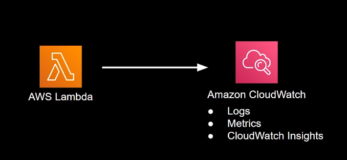
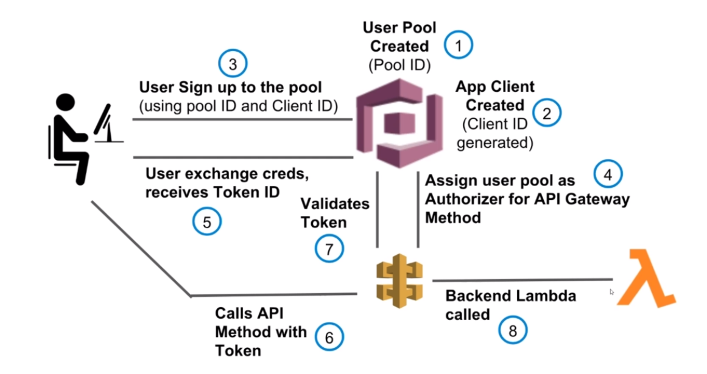
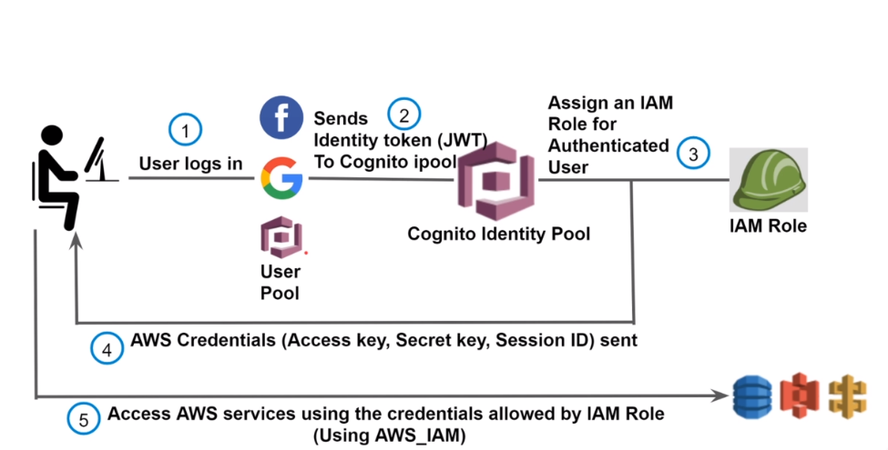
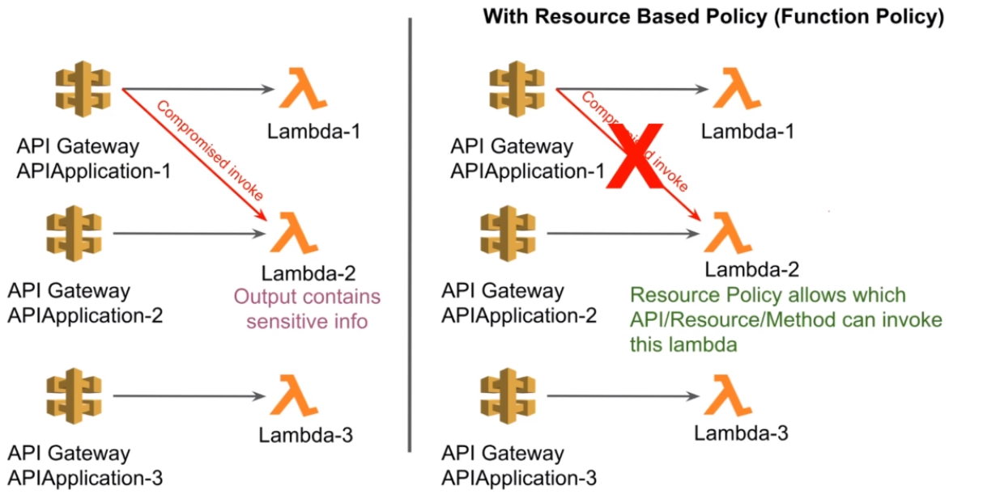
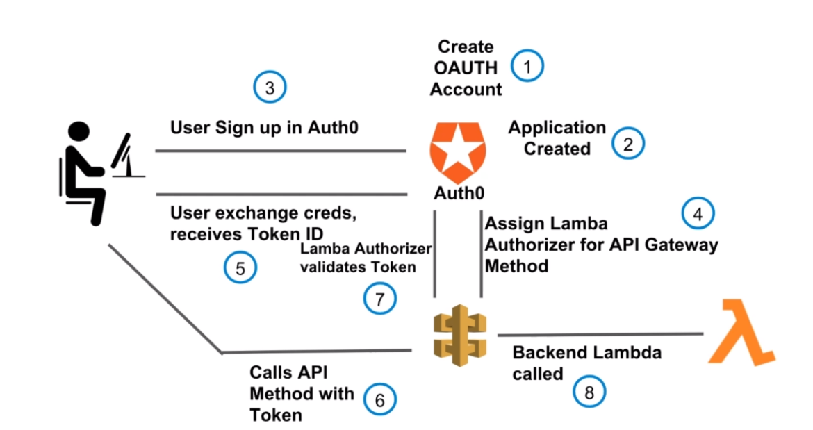
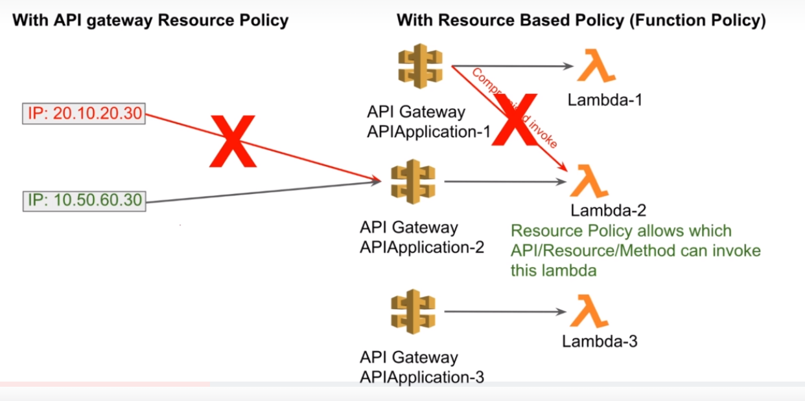
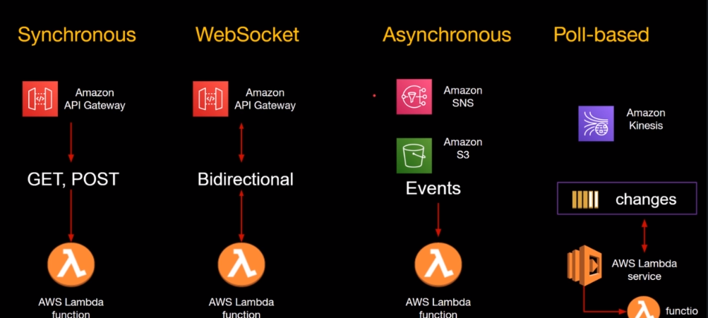
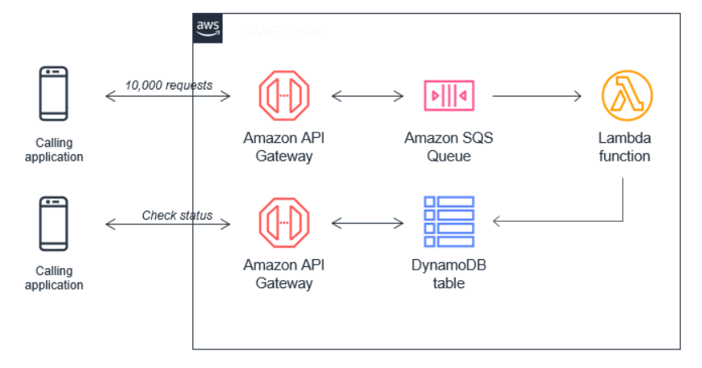
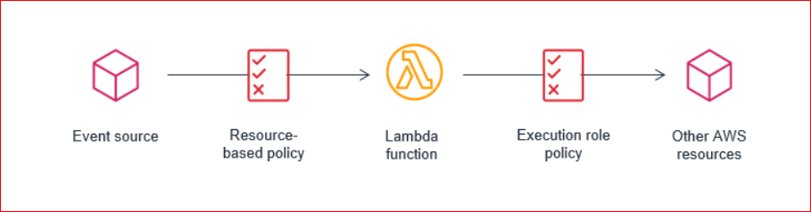
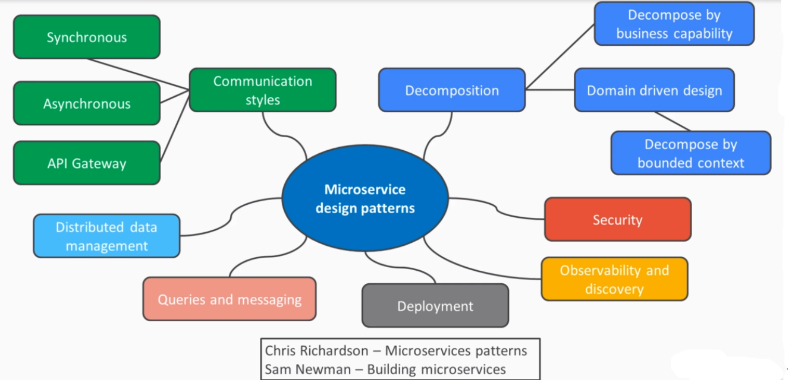

# AWS Serverless

-----

## Traditional Server in Datacenter Vs EC2 Vs Serverless

| Traditional Server      | EC2 | Serverless     |
| :---        |    :---   |          :--- |
| We own Datacenter      | We don't own Datacenter       | We don't own Datacenter   |
| We spend money for buying servers   | We just launch EC2 instances of fixed processing capacity and memory        | We utilize serverless services      |
| Scaling needs special tools   | If EC2  reached capacity, add another EC2 via ASG but with fixed predetermined capacity        | Autoscales automatically.       |
| We pay for the cost of running the datacenter. Electricity, AC, etc  | N/A        | N/A   |
| We buy enough servers upfront to accommodate huge traffic   | Sometimes traffic might be less than EC2 capacity. But still need to pay full price for EC2       | Pay for number of executions rather than idle resources   |
| Lot of money waste   | Better than Traditional Datacenter but still under utilized and paid   | Best cost optimized solution     |


## Define Serverless
- No servers to provision or manage
- Automatically scales with usage
- Never pay for idle resources. Pay for what we use
- Availability and Fault-tolerance built-in
- No AMI maintenance 

## AWS Lambda
- Lets to run code without provisioning or managing servers
- Can run code for any type of application
- Lambda takes care of HA, Scaling
- Pay only for the compute time
- Select memory from 128MB to 10GB
- CPU and Network allocated proportionally
- Max 15 mins runtime
- Can be invoked synchronously(API Gateway) and asynchronously(SQS,SNS,S3)
- Inherent integration with other services
- Cost:
  - Non expiring free tier
  - Every month we get 1M invocations and 400,000 GBs of compute
  - Charged in 1ms increments

### Create and configure Lambda from console
- Goto Lambda services from console
- Minimum details required to create Lambda function:
  - Function Name
  - Select Runtime
  - Permissions (Lambda will create an execution role with permission to upload logs to 
  CloudWatch Logs. we can modify the permissions later if we need).
      We need to configure enough permissions for the Function to communicate with other AWS 
      services. 
    - Create a new role with basic Lambda permissions (default selected)
    - Use an existing role
    - Create a new role from AWS policy templates

### Lambda Functions console
- Code Tab
    - Write code, Deploy, Test
- Test Tab
    - Pass sample event and test
    - Create test events
    - Test the function with test events. Lambda provides many test event templates already for 
        AWS services.
- Monitor Tab
    - Metrics, Logs and Traces can be viewed.
    - 
    - The CloudWatch logs can be exported to S3 bucket.
    - Subscription filters (ElasticSearch, Kinesis, Lambda) can be created on the Log Group.
- Configuration Tab
    - Basic Settings
        - Memory
        - Timeout
        - Runtime
        - Change execution role  
    - Triggers 
        - Invokes the function when the configured event happens
        - List all the triggers configured for a Lambda function 
        - 1 or more triggers can be configured for a function
        - Each trigger source(S3,DynamoDB, SQS, SNS, etc) has different events and configurations
        - Triggers can be enabled/disabled/deleted
        - Lambda will add necessary permissions on the trigger source so that the source can 
        invoke the function from this trigger. 
    - Permissions
        - Execution role
            - To view the resources and actions that the function has permission to access.
            - Example - CloudWatch permissions are created by default when we create a function.
        - Resource-based policy
            - A resource-based policy lets you grant permissions to other AWS accounts or services
              on a per-resource basis.
            - Example - Permission for API Gateway to invoke the function is added automatically 
              when we add the function as Integration Type in API Gateway configuration.  
    - Destinations
        - Refer [introducing-aws-lambda-destinations](https://aws.amazon.com/blogs/compute/introducing-aws-lambda-destinations/)
        - Destinations for asynchronous invocations is a feature that provides visibility into 
        Lambda function invocations and routes the execution results to AWS services, simplifying event-driven applications and reducing code complexity.
        -  On Success/Failure, results can be sent to Amazon Simple Notification Service (SNS), 
        Amazon Simple Queue Service (SQS), Another Lambda or Amazon EventBridge for further 
        processing.
    - Environment Variables
        - key-value pairs that we can dynamically pass to the function without making code changes.
        - Available via standard environment variable APIs.
        - Can be encrypted via AWS KMS.
        - Useful for different stages (dev,testing,production,etc)
    - Tags
    - VPC
    - Monitoring and operations tool - By default, Logs and Metrics enabled. By default, 
        X-Ray Tracing is disabled. Observability tools can be added as extensions.
    - Concurrency
        - By default, "Unreserved account concurrency" is 1000 and its used for a function.
        - Provisioned concurrency configurations - To enable your function to scale without fluctuations in latency, use provisioned 
          concurrency. Provisioned concurrency runs continually and has separate pricing for concurrency and execution duration.
    - Asynchronous invocation
        - Maximum age of unprocessed event to stay in queue.(default:6h)
        - Retry attempts(default:2)
        - DLQ 
    - Code Signing
        - Use code signing to restrict the deployment of unvalidated code.
    - Database proxies
        - Add RDS Proxy
    - File Systems
        - Add EFS 
    - State Machines
- Alias Tab
- Versions Tab
    - Create Version
        - Publish new versions of a function.
        - $LATEST always points to latest published version.
        - If we have published versions v1 and v2, then $LATEST points to v2.
- Alias Tab
    - Create Alias
        - An alias is a pointer to one or two versions. 
        - You can shift traffic between two versions, based on weights (%) that you assign.
        - NOTE: $LATEST is not supported for an alias pointing to more than 1 version
        - The API Gateway can refer ``lambdaFunctionName:lambdaAlias`` or  
            ``lambdaFunctionName:${stageVariables.lambdaAlias}`` to send traffic to specific alias 
            which in turn send traffic configured versions.

### Lambda Scaling and Concurrency
- When a Lambda is invoked, the following steps happen
    - Container comes up.
    - Loads the function code.
    - Runs the code.
- Cold Start : Container comes up + Loads the function code
- Limit of scaling - How many concurrent invocations can a Lambda execute?
- Rate of scaling - How fast the containers come up?
- Unreserved account concurrency : At any point in time, the total number of 
concurrent executions for all Lambdas defined in a AWS Account.
- Reserve concurrency : Total number of concurrent executions for a specific Lambda. If 
concurrent invocations > reserve concurrency, then (concurrent invocations - reserve concurrency)
 are throttled. 
- Provisioned concurrency : 
    - Pre-initialized execution environments.
    - No cold start or Throttling due to Super Fast Scaling.
    - AWS will keep assigned capacity "warm".
    - It can be **configured only for an Alias or Version**. 

### Lambda and External Dependencies
- By default, Lambda environment provides some dependencies like json, boto3.
- If we use a dependency which is not provided by Lambda environment, then function execution 
will fail. It will throw an error **Unable to import module 'lambda_function': No module named 
'modulename'**
- When we work from our laptop, we need to install the dependencies using npm, pip, mvn, yum, 
etc, package as zip and deploy it.
- If we work on Cloud9, then we need to install the dependencies using npm, pip, mvn, yum, 
etc and deploy it. Cloud9 takes care of zip the function along with dependencies.

### Lambda Container Images
- AWS provides base images with some dependencies and our function code is executed on it.
- Runtime interface client manages the interaction between Lambda service and your function code.
- If we want to use our own image, then we can package and deploy Lambda function as container 
images. We need to use AWS provided base image to build our custom image.
    - Custom image should include Runtime Interface client
    - Supports Linux based image currently
    - Supports specific container image settings
- This does not run Lambda code on EKS/ECS. (NOT Knative /CloudRun equivalent).
- Advantages:
    - Utilize existing container tooling
    - Create image with what you need
    - Perform local testing with runtime interface emulator 
    - Container image can be upto 50GB in size. But zip deployment is 50MB only.
- We need to pay for ECR for storing container images
- This feature is supported in AWS CLI, CloudFormation, SAM.

### Lambda Layers
- Lets functions easily share code: Upload layer once, reference within any function.
- Layer can be anything: dependencies, training data, configuration files, etc.
- Promotes separation of responsibilities, lets developers work faster on writing business logic.
- Built-in support for secure sharing by ecosystem.
- Layers get loaded with function code and hence no additional execution latency. No impact on 
execution time of function.
- A function can have upto 5 layers.
- 250MB is the total size limit which includes total layers + unzipped function code.
- version the layers and deploy across accounts.
- The layers should be created under a specific directory and zip it. Refer AWS Lambda docs.
- Create Layer from console:
    - Layer name (or)
    - You can enter the ARN for the layer directly. This ARN can point to layers in a different 
        AWS account (but has to be in the same region). This allows you to use layers published by third-party vendors.
    - The zip file needs to be uploaded either from local or S3 bucket
    - Select the Runtime
- When a new version of the layer is published, you would need to deploy an update to the Lambda functions and explicitly reference the new version.

### Lambda and EFS Integration
- By default, Lambda runtime container provides 512MB of ephemeral space. It can't be used for 
durable storage.
- EFS is a AWS managed Elastic File System and its fully durable.
-  We can mount same EFS onto multiple Lambda functions. Each Lambda can perform certain 
operations like Write, Read, Delete on the shared EFS.
- EFS is pay for what you use unlike EBS, RDS.
- EFS is shared across concurrent executions of a Lambda function.
- EFS can be used with **Provisioned Concurrency**.
- Some use cases of EFS:
    - Process large files across multiple functions
    - Use other services like EKS, EC2 with Lambda
    - Lambda is not Stateless anymore.
- Refer [shared-file-system-for-your-lambda-functions](https://aws.amazon.com/blogs/aws/new-a-shared-file-system-for-your-lambda-functions/) 
- The EFS is created in a specific VPC and we can span it across all AZs.
- The Lambda should have permissions of **AWSLambdaVPCAccessExecutionRole, 
AmazonElasticFileSystemClientReadWriteAccess** inorder o work with EFS. In a production environment, you can restrict access to a specific VPC and EFS access point.
- The Lambda function should be attached to the VPC where EFS is created. Select the VPC subnets 
and security groups.
- Then add the File System to Lambda and configure the mount path.

### Lambda and RDS Proxy
- When load increases, API Gateway and Lambda can scale and handle the load. But AWS RDS is not.
- AWS RDS can handle limited number of connections. Orphan connections stay.
- Database needs to spend CPU/Memory for connection management.
- Lambda can exhaust connection limit leading to throttle or error.
- AWS RDS Proxy sits between Lambda and RDS. It is fully managed, highly available database proxy.
- It maintains connections pool and allows applications to share it.
- It uses Secrets Manager for DB credentials.
- If RDS fails and creates a new instance, before the DNS points to the new DB instance, 
    RDS proxy can point to the new instance. Failover without DNS change, 66% reduced failover time for Aurora, RDS.
- We can allocate how many connections Lambdas are allowed to use.
- Amazon RDS Proxy is priced per vCPU per hour for each database instance for which it is enabled.
- Setup:
    - IAM role for RDS Proxy so that it can reach RDS DB and Secrets Manager
    - IAM role for Lambda to reach RDS Proxy.
    - Everything within the VPC
        - Proper security groups for Lambda to Proxy to RDS
        - DB should be launched in private subnet
    - Lambda requires external dependency like RDS MySQL. 
    
### Lambda Function code
- If the function returns response with statusCode, then that's the status code returned to 
client. If no statusCode is set, then by default the status code returned is 200.
- If the function throws an unexpected error, then the status code returned is 502, Internal 
server error

## IAM
- Policy 
    - A Policy is an json object that when associated with an identity or resource, it defines 
their permissions.
    - The json object contains "Effect", "Action", "Resource", "Principal", "Condition"
    - The policy can be attached to users, groups or roles
- User
    - An IAM user can represent a person or application that interact with AWS.
    - access key ID and secret access key
    -  username and password
- Roles 
    - Policies can't attached to any AWS services directly
    - Policies are associated with service role and which inturn is associated to AWS service.
    - When we login as admin IAM user who has all the permissions, can't the services access 
    everything? Nope, we need to configure each service with a role to run with. This separation 
    of permissions between user roles and service roles is necessary to reduce blast radius.

## API Gateway
- API - Application Programming Interface is a set of clearly defined methods of communication 
between various components.
- Functions of API Gateway:
  - Lets us to create, configure and host a API.
  - Authentication and Authorization of API.
  - Tracing, Caching and Throttling of API requests.
  - Staged deployments, Canray release
  - and much more
  

  
### API Gateway Console
- APIs
    - Create API
        - Create New API, Clone from Existing API, Import from Swagger, Example API
        - API name, Description, Endpoint Type(Regional by default)
            - API:
                - Resources
                    - Could be different projects/business areas  
                    - Create Method, Create Resource, **Enable CORS**, Deploy API, Import API, 
                    Delete API
                    - Multiple resources can be created under a single API 
                    - Create Resource - Create a RESTFul resource
                    - Create Method - Provides HTTP method. The Integration type available are 
                    Lambda function(default), HTTP, Mock, AWS Service, VPC Link. Authorization 
                    and API key can be configured.
                    - Deploy API - Deploys the API to a stage. We need to create or select exiting
                     stage. The resource that is not deployed can't be accessed from browser. But
                      It can be tested from API Gateway console itself.
                - Stages
                    - The stage created using "Deploy API" is shown here.
                    - Invoke URL is available for each stage. But it requires "Authentication 
                    Token".
                    - Invoke URL is available for each Method under each Resource in each stage. 
                      This is url can be accessed from browser.
                    - Cache settings : API cache can be enabled/disabled.
                        - Cache can be enabled per Method level if it has queryParams.
                        - 0.5GB to 237GB
                        - Encrypt cache, TTL can be configured
                        - Caching is for GET requests
                        - Use CloudWatch API Cache Metrics.
                        - Its not available for free tier.
                    - Logs/Tracing
                        - CloudWatch Logging(Execution Logging)
                            - Logs related to execution of API
                            - Includes log for
                                - Request/Response payloads
                                - API keys
                                - Usage plans
                                - Data used by Lambda authorizers(custom authorizers)
                            - Log group would be created automatically, named 
                            API-gateway-Execution-Logs_{rest-api-id}/{stage_name} format
                        - Access Logging
                            - Logs related to access to API
                            - Includes logs for
                                - Who accessed the API
                                - How the caller accessed the API
                            - Create a new Log Group or send to existing one
                            - Logs can be generated in CLF, JSON, XML, CSV formats for ease of 
                            consumption by log analysis system if available
                        - Enable X-Ray Tracing
                        - Execution, Access logging, X-ray are chargeable. No free tier.
                    - Stage Variables
                    - Stage level throttling  can be enabled/disabled, throttling value can be 
                    modified. Each Method in this stage respect the rates configured. Default 
                    Rate is 10K/sec and Burst is 5K/sec.
                    - WAF
                        - API Gateway requires a Regional web ACL.
                        - AWS WAF is your first line of defense against web exploits. When AWS WAF is enabled on an API, AWS WAF rules are evaluated before other access control features
                    - Canary
                        - A Canary is used to test new API deployments and/or changes to stage variables. A Canary can receive a percentage of requests going to your stage. In addition, API deployments will be made to the Canary first before being able to be promoted to the entire stage.
                        - Canary Stage Request Distribution, Cache, Canary Stage Variables can 
                          be configured.
                        - After testing, "Promote Canary" to the stage.
                    - Deployment History
                    - SDK Generation
                    - Export
                    - Client Certificate - Certificate that API Gateway will use to call the 
                    integration endpoints in this stage
                - Authorizers
                    - Lambda
                    - Cognito
                - Gateway Responses
                - Models
                - Resource Policy
                    - Configure who can access the API.
                - Dashboard
                    - API calls count, Latency, Integration Latency, 4xx, 5xx errors metrics are 
                    displayed.
                - Settings
                    - By default, Execution logs and Access logs are disabled for API Gateway
                    - We need to create a role in IAM for an API Gateway with permissions to log 
                    in CloudWatch. This role once created will be automatically attached to API 
                    Gateway.
                    - Then, Settings(this section) will show the role that is created in the 
                    previous step.
      
- Usage Plans
    - A Usage plan provides selected API clients with access to one or more deployed APIs. You 
      can use usage plan to configure throttling and quota limits, which are enforced on individual
      client API keys.
    - Create Usage plan with throttling, burst, quota limits.
    - Associate the Usage plan with 1 or more API stages. Throttling and Burst can be configured 
    (its optional) for each Resource & Method under each API.
    - Create API Key - it can be auto-generated and custom.
    - Attach the API Key with the Usage Plan.
    - NOTE : But at this stage, still we can access our APIs without API key.
    - So, navigate API->Resources->Method and set "API Key Required" as true, and deploy it the 
    respective API Stage.
    - NOTE: Now the client needs API Key in request header **x-api-key**
- API Keys
- Custom Domain Names
    - Register a domain abc.com in Route53.
    - Create certificate from ACM for the domain abc.com
    - Create a Custom Domain Name in API Gateway for abc.com
        - Configure TLS version
        - Endpoint configuration
        - Select ACM certificate created in previous steps.
        - After creating, it generates a API Gateway Domain Name and Hosted Zone ID.
    - In Route53->Hosted Zones, the domain abc.com is available. 
        - Add a record of Type A.
        - Select a Routing policy.
        - For Value/Route Traffic to -> Select "Alias to API Gateway API", select the region and 
          select the API Gateway Domain Name.
        - Select the Record Type.
    - Under Custom Domain Name in API Gateway for abc.com, add API mappings. Select the API that 
    needs to be mapped to this domain.  
- Client Certificates
- VPC Links
- Settings 

### API Gateway Components

- The default error response from apigateway->lambda exposes the lambda function name to outside 
world.
- API Developer - Your AWS account that owns the API Gateway deployment.
- App Developer - An app creator who may or may not have an AWS account and interacts with the 
API that you, the API developer, have deployed. App developers are your customers and he is 
identified by an API Key.
- Method Request
    - Gets unique ARN 
    - Query params, HTTP request headers, Request Body(Content-Type) expected in request can be 
    configured
    - Request validators for Headers, Query params, body can be configured.
    - API key required - true/false. By default its false
    - Authorization - None, AWS_IAM. so per method authorization is possible to implement. 
        - **AccessKey** and **SecretKey** needs to be sent in http headers.
- Integration Request
    - Select the Integration type.
    - The Integration endpoint can be from same AWS account or from other account as well.
        - Same AWS Account - Refer the destination just by name. example - lambda function name.
        - Cross AWS Account - Refer the destination using the ARN. example - lambda function arn
            - We need to add appropriate function policy on the function in another account. We 
            can do it through aws-cli. The command is generated by console.
    - Lambda as Integration:
        - In order to implement traffic splitting using lambda alias and version, we need refer 
          the function as ``lambdaFunctionName:${stageVariables.lambdaAlias}``
        - For this, we need set appropriate function policy on the function. We can do it through
          aws-cli. The command is generated by console and we need to update the appropriate alias.
        - Deploy the API again.
        - Set the stage variable ``lambdaAlias``.
        - Launch the URL and the traffic will be routed to 2 different versions of a function. 
        
    - URL path parameters, URL query parameters, URL Headers from request can be mapped to 
    Integration request. 
    - Using Mapping Templates(velocity template) grab query params from URL and pass it
    in "event" object.
    - {"country":"${method.request.querystring.nameOfCountry}"}, here "nameOfCountry" is the query param and 
    "country" is populated in "event" object.
    - {"country":"${method.request.path.myparam1}"}, where myparam1 is path parameter.
    - {"country":"${method.request.header.myparam2}"}, where myparam2 is header parameter.
- API Gateway Endpoints Type
    - Edge Optimized - Designed to help you reduce client latency from anywhere on the Internet.
      
    - Regional - Designed to reduce latency when calls are made from the same region as the API.
      
      
    - Private - Designed to expose API's only inside your VPC.
      
    - NOTE: Endpoint type can changed at any time.

### CORS(Cross-Origin Resource Sharing) with API Gateway
- Browser security feature that restricts cross-origin HTTP requests.
- What qualifies for Cross Origin HTTP Requests?
    - A different domain (from abc.com to xyz.com)
    - A different sub-domain (from abc.com to mnc.abc.com)
    - A different port (from abc.com:8080 to abc.com:8081)
    - A different protocol (from https://abc.com to http://http.com)
- So web applications using the API can only request resources from same origin that the 
application is loaded from unless we can configure CORS.
- CORS headers sent from remote service to client:
   
   ```
   Access-Control-Allow-Headers
   Access-Control-Allow-Methods
   Access-Control-Allow-Origin
   ```
- CORS Types:
    - Simple:
        - Only GET, POST, HEAD
        - POST must include Origin Header
        - Request payload content type is text/plain, multipart/form-data or 
        application/x-www-form-urlencoded
        - Request does not contain custom header
    - Non Simple
        - Almost all real world api's

### API Gateway HTTP API Vs REST API
- HTTP API:
    - If we need only integration is Lambda and HTTP URLs.
    - Low-latency, cost-effective integration with Lambda and HTTP URLs.
- HTTP Vs REST API
    - It supports only **Regional** endpoint type. But REST API supports all.
    - It supports only **HTTP Proxy, Lambda Proxy and Private Integration** integration types. But REST API supports all.
    - On security perspective, it does not support **client certificates, WAF, Resource 
    Policies**. But REST API supports all.
    - It supports **Amazon Cognito and Native OpenID Connect/OAuth2.0** authorizers. But REST API
     supports **AWS Lambda, IAM, Amazon Cognito**.
    - On API management, it supports **Custom Domain Names**. But REST API supports **Usage 
    Plans, API Keys, Custom Domain Names**.
    - On Monitoring, it supports **CloudWatch Logs and Metrics**. But REST API supports 
    **CloudWatch Logs, CloudWatch Metrics, Kinesis Data Firehouse, Execution Logs, AWS X-Ray**.
    
## AWS Event Bus
- It exists in CloudWatch Section.
- A mechanism that allows different components to communicate with each other without knowing 
about each other.
- AWS Services from same or different accounts can publish events on the bus and other AWS 
services can consume.

## AWS Event Bridge
- EventBridge is a serverless service.
- Easily build event driven architectures.
- Existing Event Bus is a subset of EventBridge.
- AWS Services from same or different accounts, SaaS Providers can publish events on the bus and other AWS services can consume.

## SQS, SNS, Lambda
- AWS Lambda Service polls SQS queue continuously  for messages.
- SQS Queue:
    - The batch size limit is 10
    - 5 <= polling limit <= Lambda concurrency limit
    - When the messages are getting processed by Lambda, then those messages are not visible to 
    other consumers. It has visibility timeout.
    - If all messages are processed successfully, AWS Lambda Service deletes messages from SQS.
    - Lambda Service rollsback entire batch if one or more message fails. Messages can be 
    reprocessed. So to avoid it, our own Lambda function can delete successfully processed 
    messages from SQS.
    - Sync To Async : High Volume Traffic
    - **Synchronous Architecture**
    - In Synchronous Architecture, all components need to scale together.
    - Scaling is as high as scaling capacity of lowest scalable component.
    - Each component will keep running till the whole chain finishes.
    - If one component fails, whole call fails.
    - **Asynchronous Architecture**
    - In Asynchronous Architecture, all components can scale separately.
    - Less aggressive scaling requirement on Lambda.
    - Retry mechanism available even if one component fails.
    - Control traffic to downstream.
- **Tips for SQS and Lambda**
    - Set function concurrency to 5 or more.
    - Less than 5 function concurrency can lead to throttling error.
    - Set Queue's visibility timeout to at least 6 times the timeout of Lambda function.
    - Configure DLQ to keep messages to be reprocessed.
    - POST request can be Async, GET request can be Sync.
    - High volume S3 processing - s3->Lambda(Triggered from s3)->SQS->Lambda(processing) 
    - Reliable Fanout Architecture
    
## Step Functions
- AWS Step Functions is a serverless function orchestrator that makes it easy to sequence AWS Lambda functions and multiple AWS services into business-critical applications.

- Types
    - Standard
    - Express

- Service Integration Patterns
    - Request Response
        - The step function does not wait for the invoked service to complete. Step function 
        executes the next state without waiting for completion of submitted task in previous state.
    - Run a Job(.sync)
        - The step function does waits for the invoked service to complete.
    - Wait For Callback(.waitForTaskToken)
        - Step Function pass a task token to integrated service
        - Workflow paused until task token is returned
        - Can wait for a year. But we can configure using "hearBeatSeconds"
- Activities
    - Step Function invokes an activity(ARN of an Activity) with an Input and Task Token
    - The specific Activity reads the Input and Task Token and perform some operations
    - Once its done, the paused state in the Step Function can be completed by submitting the 
    Task Token.
    
## CloudTrail Vs CloudWatch Logging
- CloudTrail does infrastructure logging
- Example : 
    - Creation/Deletion of S3 bucket
    - Creation/Deletion of VPC
    - Creation/Deletion of Security Group
- CloudWatch does Application Logging
- Example :
    - API request/response payload
    - Logging from your Lambda code
    - Logs for execution of your API
- CloudTrail logs can be sent to CloudWatch logs
- All the logs can be fed to an analytic system for actionable insights

## AWS CloudWatch Log Insights
- Fully managed log query tool
- AWS managed service
- No setup, maintenance required
- Queries massive amount of logs in seconds
- Produce visualizations
- Lots of pre-built queries
- Other 3pp tools can be used as well - CloudHealth, dashbird, IO pipe, Datadog or AWS Athena

## AWS X-ray
- Distributed tracing system
- Shows map of underlying components
- Identify root cause of performance issues
- By default, X-Ray logs the time duration taken by each service.
- If we want more details, we can import x-ray sdk and annotate each lambda function with some 
details. Then those details are available in tracing.

## Security of Serverless APIs
- API Keys and Usage Plans
- Using IAM credentials
- AWS Cognito User Pools
- AWS Cognito Identity Pools
- AWS Secrets Manager
- Lambda Resource Policy
- Lambda Authorizer (Custom Authorizer)
- API Gateway Resource Policy

### API Keys and Usage Plans
- If we want to group different APIs, then we need to use Usage Plans.
- Usage plans control Throttling, Bursting and Quota. Usage Plans help you meter API usage.
- Throttling limits define the maximum number of requests per second available to each key. 
- Quota limits define the number of requests each API key is allowed to make over a period. 
- An API key can be assigned to a Usage Plan. So any APIs under this Usage Plan, can use this API
 Key.
- Whoever has access to API Key can access the APIs. 

### Using IAM credentials
- IAM credentials - Access Key ID and Secret Access Key
- The entity that the Access Key ID and Secret Access Key is attached to should have policies
(AmazonAPIGatewayInvokeFullAccess) defined for API invocation.
- Granular access at Method level is possible. Example, 3 different users can only access 
specific Method for which they have been assigned policies. Each user will have policy assigned 
which allow them to invoke only specific Method on a Resource.

````json
{
  "Version": "2012-10-17",
  "Statement": [
    {
      "Action": "execute-api:invoke",
      "Effect": "Allow",
      "Resource": "arn:aws:execute-api:eu-west-1:*:<unique-id-for-API>/<STAGE>/<METHOD>/<RESOURCE>"
    }
  ]
}
````
- Whoever has access to Access Key ID and Secret Access Key can access the APIs. They are not 
rotated periodically.

### AWS Cognito User Pools
 

- The token has expiry.
- We can't assign any IAM role for Cognito Users.
- If we associate an Authorizer to the API Method and if that authorizer is authorizing 
against the Cognito User Pool, the user will be able to call all the Methods.
- There is no way to support granular access based on IAM role in Cognito User Pool.

### AWS Cognito Identity Pools

- It leverages both IAM role and JWT token.
- Granular access at Method level is possible because it leverages IAM role.

### AWS Secrets Manager
- It stores API Key, DB Credentials, encrypted with KMS key.
- Can rotate the credentials periodically.
- The credentials are not hard-coded into the code.
  
### Lambda Resource Policy

- Specifies which AWS entity can invoke this particular Lambda.
- By default, if we invoke Lambda from API gateway in same AWS account, resource policy of Lambda
 is automatically updated to allow the invocation.
- For real world projects, console access beyond development should be prohibited and should be 
 deployed through CI/CD toolchain with resource policy defined in CloudFormation.
    - CI/CD ensures userid(who is deploying) belongs to application ID.
- By default, if we invoke Lambda from API gateway from different AWS account, resource policy of
 Lambda needs to be updated explicitly.
 
### - Lambda Authorizer (Custom Authorizer)

- Auth0 is the 3rd party application.

### API Gateway Resource Policy


## Storage for Serverless
- SQL, NoSQL DB
### Issue with Lambda and Traditional DB
- Lambda has massive concurrency limit and can scale unlimited as the load increases. But DB have 
fixed Read Write Limit(Pay for max limit). At some point, the DB will reach max limit, DB response slows and app might crash.
- So we need DB where the Read Write is scalable as well. Pay as per usage.
- Auto Scalable storage options for Lambda:
    - NoSQL DynamoDB
    - Aurora Serverless
    
## DynamoDB
- Fully managed NoSQL DB
- Hardware provisioning, setup and configuration, replication, software patching, cluster scaling
 managed by AWS
- Store and retrieve any amount of data
- Serve any level of request traffic
- Autoscaling
- Highly available and Durable
- Multi-region, Multi-master DB using Global Tables
- Encryption at rest
- Schemaless
 
### DynamoDB core components
- Tables - A Table is a collection of data.
- Items - An item is a group of attributes that is uniquely identifiable among all of the other 
items.
- Attributes - Each item is composed of one or more attributes. An attribute is a fundamental 
data element, something that does not need to be broken down any further.
 
### Keys in DynamoDB
- Primary Key - The Primary Key uniquely identifies each item in the table, so that no items can 
have the same key. 
- Partition Key - A simple primary key, composed of one attribute known as the partition key.
- Partition Key and Sort Key - Referred as Composite Primary Key which is composed of two 
attributes. The first attribute is the Partition Key and the second attribute is the Sort Key. No
 two items can have same combo of these two attributes.
- Partition Key is also referred as hash attribute, Sort Key is also referred as range attribute.

### Create Table in DynamoDB
- Details required to create a table
    - Name of the table
    - Primary key (data types supported - string,number,binary)
    - Sort key
- Created Table has below tabs
    - Overview Tab
        - General Information
            - Capacity mode - By default, it is **provisioned**
        - Items Summary
            - Displays items in the table
            - Item can be created. Partition key is must while creating an item.
        - Table Capacity Metrics
    - Indexes Tab 
        - Global secondary indexes - Global secondary indexes allow you to perform queries on attributes that are not part of the table's primary key.
    - Monitor Tab  
        - CloudWatch Alarms - Create and manage your alarms in CloudWatch, then monitor them in context in DynamoDB
        - CloudWatch Insights
        - CloudWatch Metrics
    - Global Tables Tab
        - Other AWS Regions to which you have replicated this table.
    - Backups Tab
        - Point-in-time recovery - Point-in-time recovery provides continuous backups of your DynamoDB data for 35 days to help you protect against accidental write or deletes. Additional charges apply
        - On-demand backups
    - Exports and Streams Tab
        - Export to S3
        - Amazon Kinesis data stream details
            - Kinesis Data Streams for DynamoDB captures item-level changes in your table, and replicates the changes to a Kinesis data stream. You then can consume and manage the change information from Kinesis. 
        - DynamoDB stream details
            - Capture item-level changes in your table, and push the changes to a DynamoDB stream. You then can access the change information through the DynamoDB Streams API.
            
### DynamoDB Secondary Indexes
- A Secondary Index lets us to query the data in the table using an alternate key, in addition to
 queries against the primary key.
- Global Secondary Index:
    - An index with a partition and sort keys that can be different from those on the table.
- Local Secondary Index:
    - An index that has the same partition key as the table, but a different sort key.
NOTE: Table design should be done in such a way that, we can maximum efficiency with minimum 
number of indexes. Index updates can be expensive.      

### DynamoDB Global Tables
- AWS manages replication across regions.
- If one table in one region goes down, DynamoDB automatically shifts the traffic to table in 
other region.
- All this works seamlessly and we no need to write custom code.

### DynamoDB Read Consistency
- DynamoDB is highly durable because the data is replicated across multiple AZ in a Region. So 
even if one AZ goes down, the application still fetch from other AZs which works seamlessly with
 additional code from us.
- If we update an item, then before its replicated to other AZs, the application might read old 
data. This is inconsistent read.
#### Eventual Consistent Reads
- Response might return old data.
- If we repeat read request after a short time, latest data is returned.
- **By default, reads are eventual consistent**.
#### Strongly Consistent Reads 
- Returns most up-to-date data.
- Reads can be made Strongly Consistent by setting **ConsistentRead** parameter to true in 
DynamoDB API call *get_item* from Lambda.
- Strongly consistent reads have less throughput than eventually consistent reads.

#### DynamoDB Reads and Writes
- DynamoDB read and write throughput is measured through capacity units.
- One Read Capacity Unit :
    - One Strongly consistent read per second for item upto 4KB in size.
    - Two Eventually consistent read per second for item upto 4KB in size.
    - For larger item, more capacity units are needed.
- One Write Capacity Unit:
    - One write per second for item upto 1KB in size. Applicable to both Strongly and Eventually consistent
    - For larger item, more capacity units are needed.
- Given lowest and highest load in KB/second for the application, we can derive lowest and 
highest read/write capacity units.

#### DynamoDB Autoscaling(Setting read/write capacity)
- Provisioned
    - Manage and optimize the price by allocating read/write capacity in advance.
    - Read Capacity
        - AutoScaling ON (Dynamically adjusts provisioned throughput capacity on your behalf in 
        response to actual traffic patterns.)
            - Minimum Capacity Units
            - Maximum Capacity Units
            - Target Utilization
        - AutoScaling OFF 
            - Provisioned Capacity Units
    - Write Capacity
        - AutoScaling ON (Dynamically adjusts provisioned throughput capacity on your behalf in 
            response to actual traffic patterns.)
            - Minimum Capacity Units
            - Maximum Capacity Units
            - Target Utilization
        - AutoScaling OFF 
            - Provisioned Capacity Units
- On-demand
    - Scales without capacity planning.
    - Possible to switch back and forth between Provisioned and On-Demand.
    - Simplify billing by paying for the actual reads and writes your application performs.
    - When to use On-demand?
        - Useful if application traffic is difficult to predict.
        - Workload has large spikes of short duration.
        - Brand new application
        
#### Encryption & Decryption of Data using CMK in Lambda
- By default, DynamoDB uses AWS managed master key for encrypting and decrypting the items from 
table.
- We can create our own master key as well.
    - Create a key
    - Assign administrator for the Key. It can be IAM user and roles.
    - Assign  IAM user and roles who can use this key to encrypt and decrypt from within the 
    applications.
    - The role selected above should be used by Lambda function if it wants to encrypt and 
    decrypt using this key.
    - The Lambda function code has to encrypt the data using this key and persist in DB.
    - The Lambda function code has to decrypt the data using this key when retrieving data from DB.
    
## AWS SAM (Serverlesss Application Model)
- Shorthand syntax to create Lambda, API, DB, Event source mappings
    - Can be written in plain CloudFormation but will be much simpler in SAM
    - Converted into  CloudFormation during deployment
- Local Debugging and Testing
- Deep integration with dev tool - AWS and External
    - IDEs. Jenkins, Stackery toolkit, etc.

- Declaring Serverless Resources
    - AWS::Serverless::Function
    - AWS::Serverless::API
    - AWS::Serverless::Application
    - AWS::Serverless::LayerVersion
    - AWS::Serverless::SimpleTable
- Package and Deploy the artifact, create the stack
    - Create a bucket named "demo-test-bucket-1" on s3 service.
    ```
    sam package --template-file <sam-template-file.yml> --s3-bucket demo-test-bucket-1 
    --output-template-file packaged-artifact.yml
    
    sam deploy --template-file packaged-artifact.yml --stack-name test-1 --capabilities 
    CAPABILITY_IAM
    ```

- deploy creates 2 stages - Prod and Stage
- The API name is the stack name
- Lambda naming convention is <stackname-functionname-randomid>

- Build with external dependencies
    ```
    sam build --template <sam-template-file.yml>
    ```
    *This will create build artifacts under .aws-sam/build*

- Invoke Lambda and API locally
    ```   
     sam local invoke HelloWorldFunction --event events/event.json
     
     sam local invoke --event events/event.json
        
     sam local start-api               
    ```
    
- View Logs
    ```
    sam logs -n HelloWorldFunction --stack-name test-1 --tail
    ```
    
- Delete Stack
    ```
    aws cloudformation delete-stack --stack-name test-1    
    ```
    
- SAM and Swagger
    - Swagger with already created Lambda
        - The swagger file needs to refer the ARN of already existing Lambda
    - Swagger with new Lambda 
        - The swagger file needs to use the FunctionName mentioned in Lambda and refer it in the 
        ARN structure.
        
## Serverless Frameworks
- Simplifies development, deployment and monitoring
- High level of abstraction
- Single pane to monitor and troubleshoot
- AWS serverless frameworks
    - AWS SAM
    - AWS CodeStar
    - AWS Amplify
    - AWS Chalice
- Third party serverless frameworks
    - Serverless Framework
    - SPARTA
    - Claudia.js
    - Zappa
    - APEX
    
## Serverless Architectures and Advanced Optimization Techniques
- Optimization options:
    - Code  
    - Execution Environment
    
- Lambda code execution:
    - Cold Start - Its the time between Lambda invoke and Lambda running
        - Container comes up
        - Loads the code
    - Run code
    - After Lambda done running, the container and some codes stay warm for certain time. So 
    another Lambda invoke will make use of the existing Container, warm codes do not re-execute
    (saving execution time) and some codes get executed again. so cold start much less on 
    subsequent execution.
    - What codes stay warm?
        - The code under lambda handler and any function calls from it will always re-execute.
        - The code at global scope(outside lambda handler) will stay warm. Eg., creating client 
        object to sns,s3,loading environment variables,etc.
        - We should not put all the code at global scope because the more code we put on global 
        scope, cold start on first execution will be longer. Also Container goes down if Lambda 
        not invoked subsequently for certain time. so we need to balance them.
        - The code that fits in to global scope is the code that executes only once and be reused
         for subsequent executions.
         - The function invoked from lambda handler should not defined above the lambda handler 
         because it falls into global scope and will be executed during code loading and executed
         again by lambda handler. This is anti-pattern.
- Lambda code optimization:    
    - Don't load libraries that are not needed. Import required libraries from package rather 
    than loading the entire package.
    - Lazy loading of libraries - Load libraries during code execution based on some conditions.
    - Separate Lambda handler(entry point) from core logic
        - Use Lambda layers for duplicated logic
    - Use Lambda functions to TRANSFORM, not to TRANSPORT
        - API directly integrate with AWS Services
        - SNS->Lambda->SQS  Vs SNS->SQS
    - Dynamic logic via configuration
        - Per function - Environment variables
        - Across functions - AWS Parameter Store/Secrets Manager
    - Read only what you need. Don't read everything and filter in Lambda.
        - Properly indexed DB
        - Use fine grained Queries
        - Use Amazon S3 select to fetch only required objects.   
    - Keep orchestration out of code - use step functions
    
- Optimizing Lambda Execution Environment
    - How much memory and time needed for Lambda?
        - Use tools to study the cold start time, initialization time and execution time of Lambda
        - AWS X-ray needs to be enabled on Lambda
        - Third party tools:
            - Datadog
            - Epsagon
            - NodeSource
            - IOPipe
            - Thundra
            - Lumigo
    - Lambda memory and compute goes together. There is no option to select CPU units.
        - Its not true that lower the memory allocated leads to lower cost. Its the combination of 
        memory and time. Higher memory and lower time out, may lead to less cost. 
        - Sometimes with increased memory, cost might increase. If performance increases 
        significantly and cost increases slightly, its worth to spend.
        - We need to define what's acceptable for our case.
        - Use [aws-lambda-power-tuning](https://github.com/alexcasalboni/aws-lambda-power-tuning)
    - Do we need to put functions in a VPC?
        - Yes, if Lambda needs to access resources in VPC like RDS
        - Yes, to restrict outbound access to Internet
    - Do we need Sync everywhere?
        - Lambda execution models
          
        - Separate Sync, Async components
            - Example: GET Sync, POST Async
        - Sending data to another system
            - Do we need to send in realtime, is near realtime okay?
            - Do we need response in the same call?
            - API Vs topic/queue/stream
    - Lambda Dead Letter Queues
        - By default, a failed Lambda function which is invoked asynchronously is retried 2 times
         and the event is discarded.
        - If DLQ is ON, then the event is sent to DLQ after 2 retries
    - Do we need APIs to expose Lambda?
        - No, if Lambda is getting called from internal systems
        - Lambda can be called from other services.
    - Events - Don't invoke Lambda unnecessarily. Apply all logic outside Lambda before invoking 
    the function. No need for if/else conditions to handle that logic in Lambda.
        - S3 -> use specific prefix
        - SNS -> Message filtering 
        
## AWS Well-Architected Framework - Five Pillars
- Operational Excellence
- Security
- Reliability
- Performance efficiency
- Cost optimization

### Serverless - General Design Principles
- Function should be simple and follows SRP
- Share nothing between invocations
- Orchestrate using state machines
- Design for failures and duplicate events
- Use events to trigger transactions

### Serverless Design Components
- Compute Layer
    - Manages requests from external systems
    - Controlling access and ensuring requests are appropriately authorized
    - Contains the runtime environment that your business logic will be deployed and executed
    - Examples : Lambda, API Gateway, Step Functions
- Data Layer
    - Persistent storage
    - Secure mechanism to store states that your business logic will need
    - Provides a mechanism to trigger events in response to data changes
    - Examples : S3, DynamoDB, Aurora Serverless
- Messaging and Streaming Layer
    - Manages communications between components
    - Manages real-time analysis and processing of streaming data
    - Examples : Kinesis, SNS
- User Management and Identity Layer
    - Provides identity, authentication and authorization for both external and internal 
    customers of your workload's interfaces
    - Examples: Cognito
- Systems Monitoring and Deployment
    - System visibility through metrics
    - Defines how the workload changes are promoted
    - Examples : CloudWatch, X-Ray
- Edge Layer
    - Manages the presentation layer and connectivity to external customers
    - Provides an efficient delivery method to external customers residing in distinct 
    geographical locations
    - Examples : CloudFront  

### Serverless Design Patterns
- RESTFul service
- Streaming service
- Periodic job
- Web application

### When NOT to use Lambda
- Always compare cost with EC2 using calculator
    - Lambda price varies based on traffic, memory and time
- Cold start in VPC
    - If Lambda in VPC, then cold start attaches ENI(Elastic Network Interface) to Lambda which 
    takes seconds. This has been improved and no more an issue. Refer
    [improved-vpc-networking-for-aws-lambda-functions](https://aws.amazon.com/blogs/compute/announcing-improved-vpc-networking-for-aws-lambda-functions/)
    - We can try to keep lambda warm using CloudWatch pings and algorithms
    - For corner cases, ultra low SLA of APIs not achievable
- Super heavy computing exceeding Lambda memory/time limit
 
## AWS Lambda Operational Practices
### Event-driven architectures
-  Address some of the inherent challenges in building the complex systems commonly used in 
modern organizations. 
- Benefits
    - Replacing polling and webhooks with events
    - Improves throughput
    - Improving scalability and extensibility
    - Reducing complexity
- Common trade-offs
    - Variable latency
        - Event-driven applications communicate across networks. This design introduces variable 
        latency.
        - Monolithic applications can almost always be optimized for lower latency at the expense
         of scalability and availability.
        - The serverless services in AWS are highly available, meaning that they operate in more than one Availability Zone in a Region. In the event of a service disruption, services automatically fail over to alternative Availability Zones and retry transactions. As a result, instead of a transaction failing, it may be completed successfully but with higher latency.
        - Workloads that require consistent low-latency performance, such as high-frequency trading applications in banks or submillisecond robotics automation in warehouses, are not good candidates for event-driven architecture.
    - Eventual consistency
        - More complex to process transactions, handle duplicates, or determine the exact overall
         state of a system.
        - DynamoDB can provide strongly consistent reads, sometimes at a higher latency.
        - Services can use Amazon RDS for features needing ACID properties.
        - Event-based architectures are usually designed around individual events instead of large batches of data.
        - In serverless, real-time event processing is preferred to batch processing in event-driven systems, replacing a batch with many smaller incremental updates. While this can make workloads significantly more available and scalable, it also makes it more challenging for events to have awareness of other events.
    - Returning values to callers
        - Caller services do not wait for requests from other services before continuing with 
        other work. This is a fundamental characteristic of event-driven architectures that enables scalability and flexibility. This means that passing return values or the result of a workflow is often more complex than in synchronous execution flows.
        - Most Lambda invocations in production systems are asynchronous, responding to events from services like Amazon S3 or Amazon SQS. In these cases, the success or failure of processing an event is often more important than returning a value.
        - For interactive workloads, the design patterns are [refer here](https://aws.amazon.com/blogs/compute/managing-backend-requests-and-frontend-notifications-in-serverless-web-apps/)
    - Debugging across services and functions
        - With different systems and services passing events, it is often not possible to record and reproduce the exact state of multiple services when an error occurs. Since each service and function invocation has separate log files, it can be more complicated to determine what happened to a specific event that caused an error.
        - For Successful debugging approach in event-driven systems:
            - a robust logging system is critical, and this is provided across AWS services and embedded in Lambda functions by Amazon CloudWatch.
            - every event has a transaction identifier that is logged at each step throughout a transaction, to help when searching for logs.
            - Finally, it’s highly recommended to automate the parsing and analysis of logs by using a debugging and monitoring service like AWS X-Ray. This can consume logs across multiple Lambda invocations and services, making it much easier to pinpoint the root cause of issues.
- Promotes the use of microservices, which are small, specialized applications performing a 
narrow set of functions. 
A well-designed, Lambda-based application is compatible with the principles of microservice architectures. 
#### How Lambda fits into the event-driven paradigm
- The main purpose of Lambda functions is to process events.
- Most AWS services generate events, and many can act as an event source for Lambda. An event 
could be custom-generated from another microservice.
- An event triggering a Lambda function could be almost anything.
- The event itself is a JSON object that contains information about what happened. Events are facts about a change in the system state, they are immutable, and the time when they happen is significant.
- Event-driven applications create events that are observable by other services and systems, but the event producer is unaware of which consumers, if any, are listening.

#### Design Principles
The goal is to develop systems that are:
- Reliable
- Durable
- Secure
- Performant
- Cost-efficient

##### Use services instead of custom code
- Lambda can be integrated with many AWS services.
- We can implement well-established, common patterns in distributed architectures using AWS Services

| Patterns      | AWS Services | 
| :---        |    :---   |  
|  Queue     | Amazon SQS        |
|  Event Bus  |   Amazon EventBridge      |     
| Pub/Sub   |  Amazon SNS      |       
| Orchestration  |  Amazon Step Functions       |   
| API   | Amazon API Gateway     |    
| Event Streams   | Amazon Kinesis  |      

- These services are designed to integrate with Lambda and you can use infrastructure as code (IaC) to create and discard resources in the services.
##### Understanding the level of abstraction
- The Lambda service limits your access to the underlying operating systems, hypervisors, and hardware running your Lambda functions. 
- Your code should assume no knowledge of how Lambda is architected and assume no hardware affinity.
- The integration of other services with Lambda is managed by AWS with only a small number of 
configuration options that are exposed.
##### Implementing statelessness in functions
- When building Lambda functions, you should assume that the environment exists only for a single invocation.
- It should not rely on any existing data structures or temporary files, or any internal state 
that would be managed by multiple invocations.
- Lambda provides an initializer before the handler where you can initialize database connections, libraries, and other resources. Since execution environments are reused where possible to improve performance, you can amortize the time taken to initialize these resources over multiple invocations. However, you should not store any variables or data used in the function within this global scope.
##### Lambda function design
- Prefer many, shorter functions over fewer, larger ones
- Lambda functions should be highly specialized, concise and generally result in shorter 
executions. 
- No knowledge or expectations of the overall workflow or volume of transactions.
- Any global-scope constants that change infrequently should be implemented as environment variables to allow updates without deployments. 
- Any secrets or sensitive information should be stored in AWS Systems Manager Parameter Store or AWS Secrets Manager
##### Building for on-demand data instead of batches
- Traditional systems are designed to run periodically and process batches of transactions that 
have built up over time.
- In Lambda-based applications, the custom processing should be triggered by every event, allowing the service to scale up concurrency as needed, to provide near-real time processing of transactions.
- If the limitations of external systems force you to use a scheduler, you should generally schedule for the shortest reasonable recurring time period.
- Functions can be redesigned to process single events and reduce the amount of time needed to 
process.
##### Orchestration
- Workflows that involve branching logic, different types of failure models and retry logic typically use an orchestrator to keep track of the state of the overall execution. Avoid using Lambda functions for this purpose, since it results in tightly coupled groups of functions and services and complex code handling routing and exceptions.
- Use AWS Step Functions to manage orchestration.
##### Developing for retries and failures
- AWS serverless services, including Lambda, are fault-tolerant and designed to handle failures.
- In the case of Lambda, if a service invokes a Lambda function and there is a service disruption, Lambda invokes your function in a different Availability Zone.
- If your function throws an error, the Lambda service retries your function.
- Functions should be designed to be idempotent.
- A Lambda function implements idempotency typically by using a DynamoDB table to track recently processed identifiers to determine if the transaction has been handled previously. The DynamoDB table usually implements a Time To Live (TTL) value to expire items to limit the storage space used.
- For failures within the custom code of a Lambda function, the service offers a number of features to help preserve and retry the event, and provide monitoring to capture that the failure has occurred. Using these approaches can help you develop workloads that are resilient to failure and improve the durability of events as they are processed by Lambda functions.

#### Anti-patterns in Lambda-based applications
##### The Lambda monolith
- In many applications migrated from traditional servers, EC2 instances or Elastic Beanstalk 
applications, developers “lift and shift” existing code. Frequently, this results in a single Lambda function that contains all of the application logic that is triggered for all events. For a basic web application, a monolithic Lambda function would handle all API Gateway routes and integrate with all necessary downstream resources.
- This approach has several drawbacks:
    - Large Package size
    - Hard to enforce least privilege
    - Harder to upgrade
    - Harder to maintain
    - Harder to reuse code
    - Harder to test
- Solution: 
    - Decompose the monolithic Lambda function into individual microservices, mapping a single 
    Lambda function to a single, well-defined task. In this simple web application with a few API endpoints, the resulting microservice-based architecture can be based upon the API Gateway routes.
    - Use strategies like [strangler pattern](https://paulhammant.com/2013/07/14/legacy-application-strangulation-case-studies/)
##### Lambda as orchestrator
- Implementing complex workflow logic in a Lambda function can result in ‘spaghetti code’ that’s 
difficult to read, understand, and maintain.
- Very fragile in production systems
- The complexity is compounded if you must handle error handling, retry logic, and inputs and outputs processing. These types of orchestration functions are an anti-pattern in Lambda-based applications.
- Instead, use AWS Step Functions to orchestrate these workflows
- Step Functions is designed for workflows within a bounded context or microservice
- Amazon EventBridge coordinates state changes across multiple services and and simplifies orchestration between microservices.
##### Recursive patterns that cause run-away Lambda functions
- Generally, the service or resource that invokes a Lambda function should be different to the service or resource that the function outputs to. Failure to manage this can result in infinite loops.
- For example, a Lambda function writes an object to an S3 object, which in turn invokes the same
 Lambda function via a put event. The invocation causes a second object to be written to the bucket, which invokes the same Lambda function.
- This anti-pattern has the potential to consume more resources. Press the “Throttle” button in 
the Lambda console to scale the function concurrency down to zero and break the recursion cycle.
- Recursive loops also exists in SNS, SQS, DynamoDB, and other services.
-  If we  need a Lambda function to write data back to the same resource that invoked the 
function, we need ensure that:
    - Use reserved concurrency
    - Use CloudWatch monitoring and alarming
    - To avoid this, use two buckets, or configure the trigger to only apply to a prefix used for incoming objects.
##### Lambda functions calling Lambda functions
- It introduces several problems in a distributed serverless architecture.
    - Cost - pay for the duration of an invocation
    - Error handling - become much more complex. Either errors are thrown to parent functions to handle at the top-level function, or functions require custom handling
    - Tight coupling - the availability of the entire workflow is limited by the slowest function.
    - Scaling - concurrency of all functions in the chain must be equal. In a busy system, this 
    uses more concurrency than would otherwise be needed.
- There are two common approaches to avoid this pattern.
    - Use an SQS queue between Lambda functions. If a downstream process is slower than an 
    upstream process, the queue durably persists messages and decouples the two functions.
    - Use AWS Step Functions
##### Synchronous waiting within a single Lambda function
- Within a single Lambda, ensure that any potentially concurrent activities are not scheduled synchronously. For example, a Lambda function might write to an S3 bucket and then write to a DynamoDB table
- The wait states are compounded because the activities are sequential. If the tasks are 
independent, they can be run in parallel, which results in the total wait time being set by the longest-running task.
- In cases where the second task depends on the completion of the first task, you may be able to 
reduce the total waiting time and the cost of execution by splitting the Lambda functions.  This approach minimizes the total wait time in the Lambda function executions.

#### Points to consider
- Separating functionality into different functions can provide better performance and also make 
an application more maintainable and scalable
- function should perform a single task in the flow of data across AWS services in your 
microservice. if the functional task is too small, this may incur additional latency in the application and overhead in managing large numbers of functions. The exact scope of a function is determined by the use case
-  Lambda function retain state between invocations in DynamoDB table is an ideal way to retain 
since it provides low-latency data access and can scale with the Lambda service, EFS provides low-latency access to file system storage

### Application Design
#### Understanding Quotas
- Service Quotas exist in all AWS services and consist of hard limits, which you cannot change, and soft limits, which you can request increases
- By default, all new accounts are assigned a quota profile. customers request increases for their accounts as they start to expand usage of their applications
- Different AWS services have different quotas. Quotas may apply at *Region level, or account 
level, and may also include time-interval restrictions (for example, requests per second)*
- Once the serverless architecture is designed, we can compare the different quotas across services and find any potential issues.
- Examples:
    - API Gateway has a default throttle limit of 10,000 requests per second. Lambda has a 
    default concurrency limit of 1,000.
    - Handling payload sizes in different services -  application moving a payload from API Gateway to Lambda to SQS, API Gateway supports payloads up to 10 Mb, while Lambda’s payload limit is 6 Mb and the SQS message size limit is 256 Kb. In this example, you could instead store the payload in an S3 bucket instead of uploading to API Gateway, and pass a reference token across the services.
- Load testing your serverless application also allows you to monitor the performance of an application
- Refer for load testing [artillery](https://artillery.io/), [gatling](https://gatling.io/)
- Using multiple AWS accounts for managing quotas,  dedicating workloads to their own specific account. This prevents quotas from being shared with other workloads or non-production resources. Using AWS Organizations, you can centrally manage the billing, compliance, and security of these accounts. 

#### Scaling and concurrency in Lambda
- All AWS accounts start with a default concurrent limit of 1000 per Region. This is a soft limit that you can increase by submitting a request 

##### On-demand scaling
- For an initial burst of traffic, your cumulative concurrency in a Region can reach between 500 and 3000 per minute, depending upon the Region. After this initial burst, functions can scale by an additional 500 instances per minute. If requests arrive faster than a function can scale, or if a function reaches maximum capacity, additional requests will fail with a throttling error (status code 429).
##### Provisioned Concurrency scaling
- The unreserved capacity pool is used by all on-demand Lambda functions. When a function is invoked, it draws from this pool. If unreserved capacity reaches zero, new invocations for any Lambda function in an account will fail.
- Provisioned Concurrency is a Lambda feature that prepares concurrent execution environments in 
advance of invocations.
- Provisioned Concurrency solves 2 issues:
    - if expected traffic arrives more quickly than the default burst capacity, Provisioned Concurrency can ensure that your function is available to meet the demand
    - if you have latency-sensitive workloads that require predictable double-digit millisecond latency, Provisioned Concurrency solves the typical cold start issues associated with default scaling.
- A function typically uses one of these two features(Provisioned or Reserved) but not both at the same 
time.
##### Using service integrations and asynchronous processing
- Synchronous requests from services like API Gateway require immediate responses. In many cases, these workloads can be rearchitected as asynchronous workloads. In this case, API Gateway uses a service integration to persist messages in an SQS queue durably. A Lambda function consumes these messages from the queue, and updates the status in a DynamoDB table. Another API endpoint provides the status of the request by querying the DynamoDB table


##### Reserved concurrency
- Lambda functions in a single AWS account in one Region share the concurrency limit. If one function exceeds the concurrent limit, this prevents other functions from being invoked by the Lambda service. You can set reserved capacity for Lambda functions to ensure that they can be invoked even if the overall capacity has been exhausted. Reserved capacity has two effects on a Lambda function:
    - The reserved capacity is deducted from the overall capacity for the AWS account in a given Region. The Lambda function always has the reserved capacity available exclusively for its own invocations.
    - The reserved capacity restricts the maximum number of concurrency invocations for that 
    function. *Synchronous requests* arriving in excess of the reserved capacity limit will fail 
    with a throttling error.
- You can also use reserved capacity to throttle the rate of requests processed by your workload. For Lambda functions that are invoked asynchronously or using an internal poller, such as for S3, SQS, or DynamoDB integrations, reserved capacity limits how many requests are processed simultaneously.
- Reserved capacity on a Lambda function also acts as a maximum capacity value. Raising the soft limit on total concurrency does not affect this behavior. If you need a function with reserved capacity to process more traffic, you can update the reserved capacity value, which effectively increases the maximum throughput of your function.

#### Choosing and managing runtimes in Lambda functions
- Developers must take action if their preferred runtime version is no longer supported by the 
maintaining organization. 
- Deprecation dates are driven by each runtime’s maintaining organization. Generally, AWS allows you to continue running functions on runtime versions for a period of time after the official runtime deprecation. You will receive emails from AWS if you have functions affected by an upcoming deprecation.

##### Runtimes and performance
- Python and Node.js are both fast to initialize and offer reasonable overall performance.
- Java is much slower to initialize but can be extremely fast once running.
- Go can be extremely performant for both start-up and execution.

##### Multiple runtimes in single applications
-  Multiple runtimes across multiple functions. This enables you to choose the best runtime for 
the task of the function.
- Node.js - Lambda function that transforms JSON between services
- Python - handling data processing 
##### Managing AWS SDKs in Lambda functions
- The Lambda service also provides AWS SDKs for your chosen runtime. These enable you to interact with AWS services using familiar code constructs.
- The bundled SDK version changes typically do not impact the functionality or performance
- To lock an SDK version and make it immutable, it’s recommended that you create a Lambda layer with a specific version of an SDK and include this in your deployment package. Additionally, packaging a function as a container image also locks the SDK version in the image.
#### Networking and VPC configurations
- Lambda functions always run inside VPCs owned by the Lambda service. These VPCs are not visible to customers, the configurations are maintained automatically, and monitoring is managed by the service.
- Lambda functions have access to the public internet. This is not the case after they have been configured with access to one of your VPCs. If you continue to need access to resources on the internet, set up a NAT instance or Amazon NAT Gateway. Alternatively, you can also use VPC endpoints to enable private communications between your VPC and supported AWS services.
- The high availability of the Lambda service depends upon access to multiple Availability Zones within the Region where your code runs. When you create a Lambda function without a VPC configuration, it’s automatically available in all Availability Zones within the Region. When you set up VPC access, you choose which Availability Zones the Lambda function can use. As a result, to provide continued high availability, ensure that the function has access to at least two Availability Zones.
- ENIs are an exhaustible resource and there is a soft limit of 350 ENIs per Region
- Most serverless services can be used without further VPC configuration, while most instance-based services require VPC configuration
#### Comparing Lambda invocation modes
- Synchronous invocation
    - CLI, ALB, API Gateway, Cognito, Lex, Alexa, API Gateway, CloudFront, Kinesis Data Firehouse
    - well suited for short-lived Lambda functions
    - API Gateway has a 29-second integration timeout, so a Lambda function running for more than 29 seconds will not return a value successfully. 
    - In synchronous invocations, if the Lambda function fails, retries are the responsibility of 
    the trigger
- Asynchronous invocation
    - S3, SNS, SES, CF, CW logs, CW events, Codecommit, CodePipeline, Config, IoT
    - The caller continues with other work and cannot receive a return value from the Lambda 
    function.
    - The function can send the result to a destination, configurable based on success or failure.
    - The internal queue between the caller and the function ensures that messages are stored durably. The Lambda service scales up the concurrency of the processing function as this internal queue grows.
    - If an error occurs in the Lambda function, the retry behavior is determined by the Lambda service.
- Polling invocation
    - DynamoDB streams, Kinesis, SQS
#### Controlling traffic flow for server-based resources
- While Lambda can scale up quickly in response to traffic, many non-serverless services cannot. If your Lambda functions interact with those services downstream, it’s possible to overwhelm those services with data or connection requests.
- The Amazon RDS Proxy service is built to solve the high-volume use-case. It pools the connections between the Lambda service and the downstream Amazon RDS database. This means that a scaling Lambda function is able to reuse connections via the proxy. As a result, the relational database is not overwhelmed with connections requests from individual Lambda functions.
- For other downstream server-based resources, APIs, or third-party services, it’s important to know the limits around connections, transactions, and data transfer. If your serverless workload has the capacity to overwhelm those resources, use an SQS queue to decouple the Lambda function from the target. This allows the server-based resource to process messages from the queue at a steady rate. The queue also durably stores the requests if the downstream resource becomes unavailable.

### Lambda Security
#### Understanding the Lambda execution environment
- When your functions are invoked, the Lambda service runs your code inside an execution environment.
- Execution environments are run on hardware virtualized virtual machines (MicroVMs) which are dedicated to a single AWS account.
- Execution environments are never shared across functions and MicroVMs are never shared across AWS accounts. 
- A single execution environment may be reused by subsequent function invocations.
#### Applying the principles of least privilege
- Lambda is fully integrated with IAM, allowing you to control precisely what each Lambda function can do within the AWS Cloud. 
- Resource policy:
    - The event source uses a resource policy that grants permission to invoke the Lambda function
- Execution role:
    - The Lambda service uses an execution role to constrain what the function is allowed to do
    


- Do not grant the function broader permissions.
- One of the fastest ways to scope permissions appropriately is to use *AWS SAM policy templates*.
 You can reference these templates directly in the AWS SAM template for your application, providing custom parameters as required
- Lambda roles must have access to *CloudWatch Logs*. If you are building a policy manually, ensure
 that it includes. If the role is missing these permissions, the function still runs but it is unable to log any output to the CloudWatch service
- Avoiding wildcard permissions in IAM policies.
- we can use [serverless-safeguards-plugin](https://github.com/serverless/safeguards-plugin/) is a policy-as-code framework to check deployed templates for compliance with security

- Avoid sharing IAM roles with multiple Lambda functions.
- Every Lambda function should have a 1:1 relationship with an IAM role. Even if some functions have the same policy initially, always separate the IAM roles to ensure least privilege policies.

#### Securing workloads with public endpoints
- Authentication relates to identity and authorization refers to actions.
- Use authentication to control who can invoke a Lambda function, and then use authorization to control what they can do. For many applications, IAM is sufficient for managing both control mechanisms.
- For applications with external users, such as web or mobile applications, it is common to use JSON Web Tokens (JWTs) to manage authentication and authorization.
- JWTs are passed from the client on every request. They are a cryptographically secure way to verify identity and claims using data passed from the client. For Lambda-based applications, this allows you to secure every call to each API endpoint without relying on a central server for authentication.
- We can implement JWTs with Amazon Cognito, a user directory service that can handle registration,
 authentication, account recovery, and other common account management operations.
- Given the critical security role of an identity provider service, it’s important to use professional tooling to safeguard your application. It’s not recommended that you write your own services to handle authentication or authorization. Any vulnerabilities in custom libraries may have significant implications for the security of your workload and its data.
- API Gateway supports authorization using AWS Lambda, IAM, or Amazon Cognito. 
- Unauthenticated API routes may be accessed by anyone on the public internet. It’s important to 
protect these against common risks, such as denial-of-service (DoS) attacks. Applying AWS WAF to these APIs can help protect your application from SQL injection and cross-site scripting (XSS) attacks. API Gateway also implements throttling at the AWS account-level and per-client level when API keys are used.
#### Encrypting data in Lambda-based applications
- Do not store plaintext secrets or API keys in Lambda environment variables.
- Do not embed secrets directly in function code
- AWS Systems Manager Parameter Store and AWS Secrets Manager provide a robust approach to storing and managing secrets used in Lambda functions.
- Using HTTPS securely
- If yu need an SSL/TLS certificate in your application, to support features like custom domain names, it’s recommended that you use AWS Certificate Manager (ACM). This provides free public certificates for ACM-integrated services and managed certificate renewal.

#### Governance controls with AWS CloudTrail
- For compliance and operational auditing of application usage, AWS CloudTrail logs activity related to your AWS account usage.
- Enabling CloudTrail does not have any negative performance implications for your Lambda-based application, since the logging occurs asynchronously.
- CloudTrail captures two types of events:
    - Control plane: these events apply to management operations performed on any AWS resources. Individual trails can be configured to capture read or write events, or both.
    - Data plane: events performed on the resources, such as when a Lambda function is invoked or an S3 object is downloaded.
- For Lambda:
    - We can log who creates and invokes functions, together with any changes to IAM roles. 
    - You can configure CloudTrail to log every single activity by user, role, service, and API 
    within an AWS account. The service is critical for understanding the history of changes made to your account and also detecting any unintended changes or suspicious activity.

- By integrating CloudTrail with EventBridge, you can create alerts in response to certain activities, and then take action accordingly.
- CloudTrail can deliver data to CloudWatch Logs and  S3 buckets as well
- If you use multiple AWS accounts, you can use AWS Organizations to manage and govern individual member accounts centrally. You can set an existing trail as an organization-level trail in a primary account that can collect events from all other member accounts. This can simplify applying consistent auditing rules across a large set of existing accounts, or automatically apply rules to new accounts. 
- Apply the principles of least privilege to Lambda functions with a VPC configuration:
    - Apply the principles of least privilege in regard to the networking configuration. This 
    includes security groups, and access via subnets, NACLs, and route tables. This ensures that traffic from the Lambda function can only reach its intended services and resources.

### Debugging
- Unexpected event payloads
- Unexpectedly large payload sizes
- Incorrectly processing payload parameters
- Running an unintended function version or alias
- Triggering infinite loops
- Downstream unavailability 
    - [add-resiliency-to-your-lambda-with-a-circuit-breaker](https://dev.to/cdkpatterns/add-resiliency-to-your-lambda-with-a-circuit-breaker-1na6)
    - Caching, Queuing, Proxies
- Memory configurations
- CPU-bound configurations - At 1.8 GB of the memory, a Lambda function has an entire vCPU 
allocated. At 10,240MB it has 6 vCPUs available.
- Timeouts - can be set between 1 and 900 seconds (15 minutes)
    - Timeouts are a safety mechanism and in normal operation do not have a negative impact on cost, since the Lambda service charges by duration. Ensure that your timeout values are not set too close to the average duration of a function to avoid unexpected timeouts.
- Memory leakage between invocations
- After the error, the Lambda service restarts the execution environment
- Asynchronous results returned to a later invocation
    - should make sure any background processes or callbacks in the code are complete before the code exits
    - If this is not possible in your use case, you can use an identifier to ensure that the 
    callback belongs to the current invocation. To do this, you can use the awsRequestId provided by the context object. By passing this value to the asynchronous callback, you can compare the passed value with the current value to detect if the callback originated from another invocation
    - In JavaScript, asynchronous callbacks are handled with an event loop. 
    - When the function’s execution environment ends, the Lambda service freezes the environment until the next invocation. After it is resumed, JavaScript continues processing the event loop, which in this case includes an asynchronous callback from a previous invocation. Without this context, it can appear that the function is running code for no reason, and returning arbitrary data. In fact, it is really an artifact of how runtime concurrency and the execution environments interact.
    - This creates the potential for private data from a previous invocation to appear in a 
    subsequent invocation. JavaScript provides the async and await keywords to simplify asynchronous development and also force code execution to wait for an asynchronous call to complete.
- Troubleshooting queue processing by Lambda functions
    - The Lambda service processes messages from SQS in batches determined by the function’s 
    batch size property. If there are still messages on the queue, Lambda then scales up the processing function up to an additional 60 instances per minute, to retrieve and process batches more quickly.
    - This continues as long as the function is not producing errors, there is sufficient unreserved capacity in your account in the current Region (or there is remaining reserved capacity for the function), and there are messages available in the queue.
    - | Service   |      Default batch size      |  Maximum batch size |
      |----------|:-------------:|------:|
      | Amazon Kinesis |  100 | 10,000 |
      | Amazon DynamoDB Streams |    100   |   1000 |
      | Amazon SQS | 10 |    10,000 |
      | Amazon MSK | 100 |    10,000 |
      
    - Identifying and managing throttling
        - Request a concurrency increase from AWS Support in this Region.
        - Identify performance issues in the function to improve the speed of processing and therefore improve throughput.
        - Increase the batch size of the function, so more messages are processed by each function invocation.
    - If the processing function throws errors, messages are returned to the SQS queue. The Lambda service prevents your function from scaling to prevent errors at scale. 
    - Identifying and handling backpressure
        - If an event producer consistently generates messages for an SQS queue faster than a Lambda function can process the handling, backpressure occurs. In this case, SQS monitoring shows the age of the earliest message growing linearly, along with the approximate number of messages visible. You can detect backpressure in queues by using CloudWatch alarms.
        - The steps to resolve backpressure depend on your workload. If the primary goal is to increase processing capability and throughput by the Lambda function
            - Request a concurrency increase in the specific Region
            - Increase the batch size of the function, so more messages are processed by each function invocation.
- Best practices for your debugging environment
    - Testing in a deployed Lambda function
    - Testing locally - Junit, AWS SAM local, Serverless offline
    - Replaying large numbers of events with Amazon EventBridge
     


## Serverless Microservices Architecture patterns
  

Refer [serverless-microservices-architecture-patterns](serverless-microservices-architecture-patterns.md)


## Lambda Best Practices
- Performance
- Scalability
- Security
- Resilience
- Observability
- Cost

Refer [lambda-best-practices](lambda-best-practices.md)

*NOTE : Images in this repository have been taken from various paid courses. I have used it for 
study purpose only. No commercial purpose.