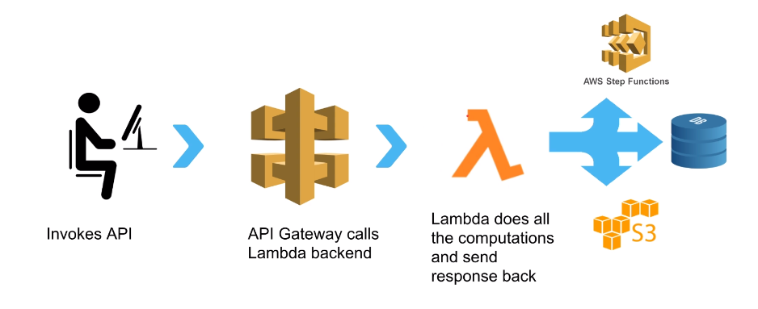
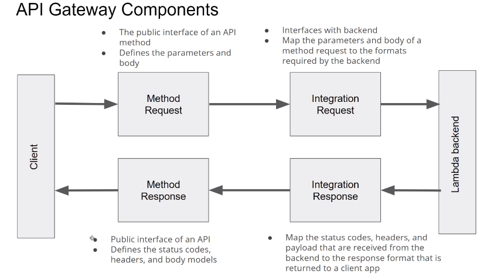
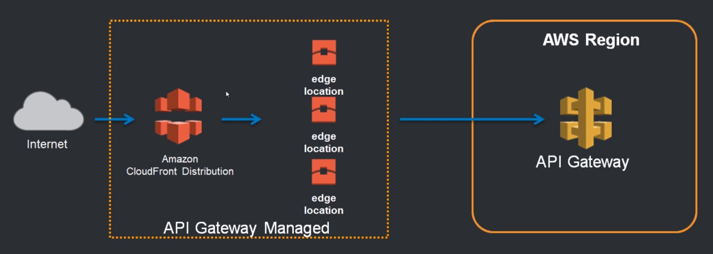
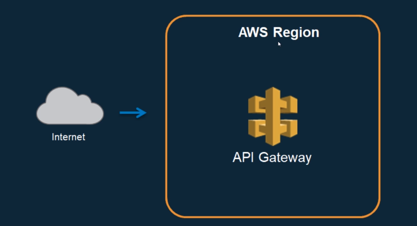
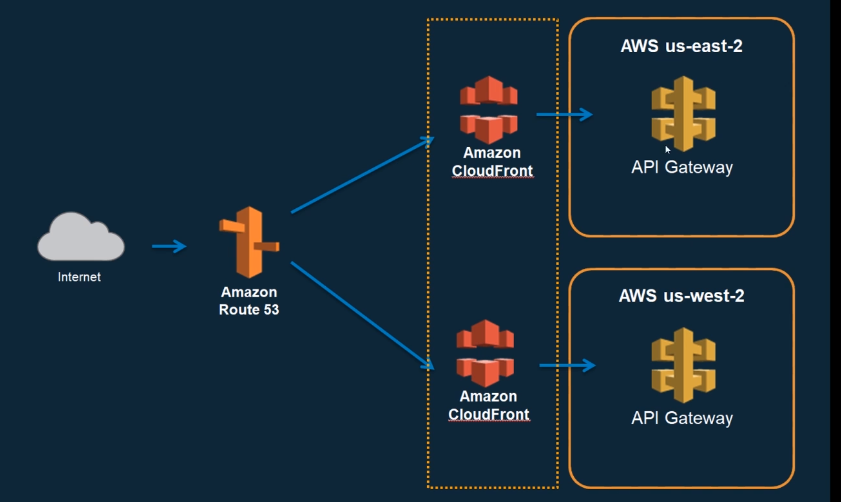
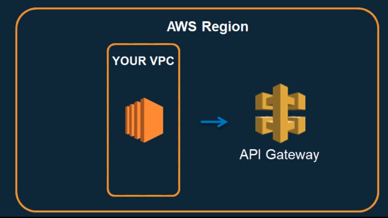

# AWS Serverless

-----

## Traditional Server in Datacenter Vs EC2 Vs Serverless

| Traditional Server      | EC2 | Serverless     |
| :---        |    :---   |          :--- |
| We own Datacenter      | We don't own Datacenter       | We don't own Datacenter   |
| We spend money for buying servers   | We just launch EC2 instances of fixed processing capacity and memory        | We utilize serverless services      |
| Scaling needs special tools   | If EC2  reached capacity, add another EC2 via ASG but with fixed predetermined capacity        | Autoscales automatically.       |
| We pay for the cost of running the datacenter. Electricity, AC, etc  | N/A        | N/A   |
| We buy enough servers upfront to accommodate huge traffic   | Sometimes traffic might be less than EC2 capacity. But still need to pay full price for EC2       | Pay for number of executions rather than idle resources   |
| Lot of money waste   | Better than Traditional Datacenter but still under utilized and paid   | Best cost optimized solution     |


## Define Serverless
- No servers to provision or manage
- Automatically scales with usage
- Never pay for idle resources. Pay for what we use
- Availability and Fault-tolerance built-in
- No AMI maintenance 

## AWS Lambda
- Lets to run code without provisioning or managing servers
- Can run code for any type of application
- Lambda takes care of HA, Scaling
- Pay only for the compute time
- Select memory from 128MB to 10GB
- CPU and Network allocated proportionally
- Max 15 mins runtime
- Can be invoked synchronously(API Gateway) and asynchronously(SQS,SNS,S3)
- Inherent integration with other services
- Cost:
  - Non expiring free tier
  - Every month we get 1M invocations and 400,000 GBs of compute
  - Charged in 1ms increments

### Create and configure Lambda from console
- Goto Lambda services from console
- Minimum details required to create Lambda function:
  - Function Name
  - Select Runtime
  - Permissions (Lambda will create an execution role with permission to upload logs to 
  CloudWatch Logs. we can modify the permissions later if we need).
      We need to configure enough permissions for the Function to communicate with other AWS 
      services. 
    - Create a new role with basic Lambda permissions (default selected)
    - Use an existing role
    - Create a new role from AWS policy templates

### Lambda Functions console
- Code Tab
    - Write code, Deploy, Test
- Test Tab
    - Pass sample event and test
    - Create test events
    - Test the function with test events. Lambda provides many test event templates already for 
        AWS services.
- Monitor Tab
    - Metrics, Logs and Traces can be viewed.
- Configuration Tab
    - Basic Settings
        - Memory
        - Timeout
        - Runtime
        - Change execution role  
    - Triggers 
        - Invokes the function when the configured event happens
        - List all the triggers configured for a Lambda function 
        - 1 or more triggers can be configured for a function
        - Each trigger source(S3,DynamoDB, SQS, SNS, etc) has different events and configurations
        - Triggers can be enabled/disabled/deleted
        - Lambda will add necessary permissions on the trigger source so that the source can 
        invoke the function from this trigger. 
    - Permissions
        - Execution role
            - To view the resources and actions that the function has permission to access.
            - Example - CloudWatch permissions are created by default when we create a function.
        - Resource-based policy
            - A resource-based policy lets you grant permissions to other AWS accounts or services
              on a per-resource basis.
            - Example - Permission for API Gateway to invoke the function is added automatically 
              when we add the function as Integration Type in API Gateway configuration.  
    - Destinations
        - Refer [introducing-aws-lambda-destinations](https://aws.amazon.com/blogs/compute/introducing-aws-lambda-destinations/)
        - Destinations for asynchronous invocations is a feature that provides visibility into 
        Lambda function invocations and routes the execution results to AWS services, simplifying event-driven applications and reducing code complexity.
        -  On Success/Failure, results can be sent to Amazon Simple Notification Service (SNS), 
        Amazon Simple Queue Service (SQS), Another Lambda or Amazon EventBridge for further 
        processing.
    - Environment Variables
        - key-value pairs that we can dynamically pass to the function without making code changes.
        - Available via standard environment variable APIs.
        - Can be encrypted via AWS KMS.
        - Useful for different stages (dev,testing,production,etc)
    - Tags
    - VPC
    - Monitoring and operations tool - By default, Logs and Metrics enabled. By default, 
    Tracing 
        is disabled. Observability tools can be added as extensions.
    - Concurrency
        - By default, "Unreserved account concurrency" is 1000 and its used for a function.
        - Provisioned concurrency configurations - To enable your function to scale without fluctuations in latency, use provisioned 
          concurrency. Provisioned concurrency runs continually and has separate pricing for concurrency and execution duration.
    - Asynchronous invocation
        - Maximum age of unprocessed event to stay in queue.(default:6h)
        - Retry attempts(default:2)
        - DLQ 
    - Code Signing
        - Use code signing to restrict the deployment of unvalidated code.
    - Database proxies
        - Add RDS Proxy
    - File Systems
        - Add EFS 
    - State Machines
- Alias Tab
- Versions Tab
    - Create Version
        - Publish new versions of a function.
        - $LATEST always points to latest published version.
        - If we have published versions v1 and v2, then $LATEST points to v2.
- Alias Tab

    - Create Alias
        - An alias is a pointer to one or two versions. 
        - You can shift traffic between two versions, based on weights (%) that you assign.
        - NOTE: $LATEST is not supported for an alias pointing to more than 1 version
        - The API Gateway can refer ``lambdaFunctionName:lambdaAlias`` or  
            ``lambdaFunctionName:${stageVariables.lambdaAlias}`` to send traffic to specific alias 
            which in turn send traffic configured versions.

### Lambda Scaling and Concurrency
- When a Lambda is invoked, the following steps happen
    - Container comes up.
    - Loads the function code.
    - Runs the code.
- Cold Start : Container comes up + Loads the function code
- Limit of scaling - How many concurrent invocations can a Lambda execute?
- Rate of scaling - How fast the containers come up?
- Unreserved account concurrency : At any point in time, the total number of 
concurrent executions for all Lambdas defined in a AWS Account.
- Reserve concurrency : Total number of concurrent executions for a specific Lambda. If 
concurrent invocations > reserve concurrency, then (concurrent invocations - reserve concurrency)
 are throttled. 
- Provisioned concurrency : 
    - Pre-initialized execution environments.
    - No cold start or Throttling due to Super Fast Scaling.
    - AWS will keep assigned capacity "warm".
    - It can be **configured only for an Alias or Version**. 

### Lambda and External Dependencies
- By default, Lambda environment provides some dependencies like json, boto3.
- If we use a dependency which is not provided by Lambda environment, then function execution 
will fail. It will throw an error **Unable to import module 'lambda_function': No module named 
'modulename'**
- When we work from our laptop, we need to install the dependencies using npm, pip, mvn, yum, 
etc, package as zip and deploy it.
- If we work on Cloud9, then we need to install the dependencies using npm, pip, mvn, yum, 
etc and deploy it. Cloud9 takes care of zip the function along with dependencies.

### Lambda Container Images
- AWS provides base images with some dependencies and our function code is executed on it.
- Runtime interface client manages the interaction between Lambda service and your function code.
- If we want to use our own image, then we can package and deploy Lambda function as container 
images. We need to use AWS provided base image to build our custom image.
    - Custom image should include Runtime Interface client
    - Supports Linux based image currently
    - Supports specific container image settings
- This does not run Lambda code on EKS/ECS. (NOT Knative /CloudRun equivalent).
- Advantages:
    - Utilize existing container tooling
    - Create image with what you need
    - Perform local testing with runtime interface emulator 
    - Container image can be upto 50GB in size. But zip deployment is 50MB only.
- We need to pay for ECR for storing container images
- This feature is supported in AWS CLI, CloudFormation, SAM.

### Lambda Layers
- Lets functions easily share code: Upload layer once, reference within any function.
- Layer can be anything: dependencies, training data, configuration files, etc.
- Promotes separation of responsibilities, lets developers work faster on writing business logic.
- Built-in support for secure sharing by ecosystem.
- Layers get loaded with function code and hence no additional execution latency. No impact on 
execution time of function.
- A function can have upto 5 layers.
- 250MB is the total size limit which includes total layers + unzipped function code.
- version the layers and deploy across accounts.
- The layers should be created under a specific directory and zip it. Refer AWS Lambda docs.
- Create Layer from console:
    - Layer name (or)
    - You can enter the ARN for the layer directly. This ARN can point to layers in a different 
        AWS account (but has to be in the same region). This allows you to use layers published by third-party vendors.
    - The zip file needs to be uploaded either from local or S3 bucket
    - Select the Runtime
- When a new version of the layer is published, you would need to deploy an update to the Lambda functions and explicitly reference the new version.

### Lambda and EFS Integration
- By default, Lambda runtime container provides 512MB of ephemeral space. It can't be used for 
durable storage.
- EFS is a AWS managed Elastic File System and its fully durable.
-  We can mount same EFS onto multiple Lambda functions. Each Lambda can perform certain 
operations like Write, Read, Delete on the shared EFS.
- EFS is pay for what you use unlike EBS, RDS.
- EFS is shared across concurrent executions of a Lambda function.
- EFS can be used with **Provisioned Concurrency**.
- Some use cases of EFS:
    - Process large files across multiple functions
    - Use other services like EKS, EC2 with Lambda
    - Lambda is not Stateless anymore.
- Refer [shared-file-system-for-your-lambda-functions](https://aws.amazon.com/blogs/aws/new-a-shared-file-system-for-your-lambda-functions/) 
- The EFS is created in a specific VPC and we can span it across all AZs.
- The Lambda should have permissions of **AWSLambdaVPCAccessExecutionRole, 
AmazonElasticFileSystemClientReadWriteAccess** inorder o work with EFS. In a production environment, you can restrict access to a specific VPC and EFS access point.
- The Lambda function should be attached to the VPC where EFS is created. Select the VPC subnets 
and security groups.
- Then add the File System to Lambda and configure the mount path.

### Lambda and RDS Proxy
- When load increases, API Gateway and Lambda can scale and handle the load. But AWS RDS is not.
- AWS RDS can handle limited number of connections. Orphan connections stay.
- Database needs to spend CPU/Memory for connection management.
- Lambda can exhaust connection limit leading to throttle or error.
- AWS RDS Proxy sits between Lambda and RDS. It is fully managed, highly available database proxy.
- It maintains connections pool and allows applications to share it.
- It uses Secrets Manager for DB credentials.
- If RDS fails and creates a new instance, before the DNS points to the new DB instance, 
    RDS proxy can point to the new instance. Failover without DNS change, 66% reduced failover time for Aurora, RDS.
- We can allocate how many connections Lambdas are allowed to use.
- Amazon RDS Proxy is priced per vCPU per hour for each database instance for which it is enabled.
- Setup:
    - IAM role for RDS Proxy so that it can reach RDS DB and Secrets Manager
    - IAM role for Lambda tp reach RDS Proxy.
    - Everything within the VPC
        - Proper security groups for Lambda to Proxy to RDS
        - DB should be launched in private subnet
    - Lambda requires external dependency like RDS MySQL. 

## IAM
- Policy 
    - A Policy is an json object that when associated with an identity or resource, it defines 
their permissions.
    - The json object contains "Effect", "Action", "Resource"
    - The policy can be attached to users, groups or roles
- User
    - An IAM user can represent a person or application that interact with AWS.
    - access key ID and secret access key
    -  username and password
- Roles 
    - Policies can't attached to any AWS services directly
    - Policies are associated with service role and which inturn is associated to AWS service.
    - When we login as admin IAM user who has all the permissions, can't the services access 
    everything? Nope, we need to configure each service with a role to run with. This separation 
    of permissions between user roles and service roles is necessary to reduce blast radius.

## API Gateway
- API - Application Programming Interface is a set of clearly defined methods of communication 
between various components.
- Functions of API Gateway:
  - Lets us to create, configure and host a API.
  - Authentication and Authorization of API.
  - Tracing, Caching and Throttling of API requests.
  - Staged deployments, Canray release
  - and much more
  

  
### API Gateway Console
- APIs
    - Create API
        - Create New API, Clone from Existing API, Import from Swagger, Example API
        - API name, Description, Endpoint Type(Regional by default)
            - API:
                - Resources
                    - Could be different projects/business areas  
                    - Create Method, Create Resource, **Enable CORS**, Deploy API, Import API, 
                    Delete API
                    - Multiple resources can be created under a single API 
                    - Create Resource - Create a RESTFul resource
                    - Create Method - Provides HTTP method. The Integration type available are 
                    Lambda function(default), HTTP, Mock, AWS Service, VPC Link. Authorization 
                    and API key can be configured.
                    - Deploy API - Deploys the API to a stage. We need to create or select exiting
                     stage. The resource that is not deployed can't be accessed from browser. But
                      It can be tested from API Gateway console itself.
                - Stages
                    - The stage created using "Deploy API" is shown here.
                    - Invoke URL is available for each stage. But it requires "Authentication 
                    Token".
                    - Invoke URL is available for each Method under each Resource in each stage. 
                      This is url can be accessed from browser.
                    - Cache settings : API cache can be enabled/disabled.
                        - Cache can be enabled per Method level if it has queryParams.
                        - 0.5GB to 237GB
                        - Encrypt cache, TTL can be configured
                        - Caching is for GET requests
                        - Use CloudWatch API Cache Metrics.
                        - Its not available for free tier.
                    - Logs/Tracing
                    - Stage Variables
                    - Stage level throttling  can be enabled/disabled, throttling value can be 
                    modified. Each Method in this stage respect the rates configured. Default 
                    Rate is 10K/sec and Burst is 5K/sec.
                    - WAF
                    - Canary
                        - A Canary is used to test new API deployments and/or changes to stage variables. A Canary can receive a percentage of requests going to your stage. In addition, API deployments will be made to the Canary first before being able to be promoted to the entire stage.
                        - Canary Stage Request Distribution, Cache, Canary Stage Variables can configured.
                        - After testing, "Promote Canary" to the stage.
                    - Deployment History
                    - SDK Generation
                    - Export
                    - Client Certificate - Certificate that API Gateway will use to call the 
                    integration endpoints in this stage
                - Authorizers
                - Gateway Responses
                - Models
                - Resource Policy
      
- Usage Plans
    - A Usage plan provides selected API clients with access to one or more deployed APIs. You 
    can use usage plan to configure throttling and quota limits, which are enforced on individual
     client API keys.
- API Keys
- Custom Domain Names
    - Register a domain abc.com in Route53.
    - Create certificate from ACM for the domain abc.com
    - Create a Custom Domain Name in API Gateway for abc.com
        - Configure TLS version
        - Endpoint configuration
        - Select ACM certificate created in previous steps.
        - After creating, it generates a API Gateway Domain Name and Hosted Zone ID.
    - In Route53->Hosted Zones, the domain abc.com is available. 
        - Add a record of Type A.
        - Select a Routing policy.
        - For Value/Route Traffic to -> Select "Alias to API Gateway API", select the region and 
          select the API Gateway Domain Name.
        - Select the Record Type.
    - Under Custom Domain Name in API Gateway for abc.com, add API mappings. Select the API that 
    needs to be mapped to this domain.  
- Client Certificates
- VPC Links
- Settings 

### API Gateway Components

- The default error response from apigateway->lambda exposes the lambda function name to outside 
world.
- API Developer - Your AWS account that owns the API Gateway deployment.
- App Developer - An app creator who may or may not have an AWS account and interacts with the 
API that you, the API developer, have deployed. App developers are your customers and he is 
identified by an API Key.
- Method Request
    - Gets unique ARN 
    - Query params, HTTP request headers, Request Body(Content-Type) expected in request can be 
    configured
    - Request validators for Headers, Query params, body can be configured.
    - API key required - true/false. By default its false
    - Authorization. so per method authorization is possible to implement. 
- Integration Request
    - Select the Integration type.
    - The Integration endpoint can be from same AWS account or from other account as well.
        - Same AWS Account - Refer the destination just by name. example - lambda function name.
        - Cross AWS Account - Refer the destination using the ARN. example - lambda function arn
            - We need to add appropriate function policy on the function in another account. We 
            can do it through aws-cli. The command is generated by console.
    - Lambda as Integration:
        - In order to implement traffic splitting using lambda alias and version, we need refer 
          the function as ``lambdaFunctionName:${stageVariables.lambdaAlias}``
        - For this, we need set appropriate function policy on the function. We can do it through
          aws-cli. The command is generated by console and we need to update the appropriate alias.
        - Deploy the API again.
        - Set the stage variable ``lambdaAlias``.
        - Launch the URL and the traffic will be routed to 2 different versions of a function. 
        
    - URL path parameters, URL query parameters, URL Headers from request can be mapped to 
    Integration request. 
    - Using Mapping Templates(velocity template) grab query params from URL and pass it
    in "event" object.
    - {"country":"${method.request.querystring.nameOfCountry}"}, here "nameOfCountry" is the query param and 
    "country" is populated in "event" object.
    - {"country":"${method.request.path.myparam1}"}, where myparam1 is path parameter.
    - {"country":"${method.request.header.myparam2}"}, where myparam2 is header parameter.
- API Gateway Endpoints Type
    - Edge Optimized - Designed to help you reduce client latency from anywhere on the Internet.
      
    - Regional - Designed to reduce latency when calls are made from the same region as the API.
      
      
    - Private - Designed to expose API's only inside your VPC.
      
    - NOTE: Endpoint type can changed at any time.

### CORS(Cross-Origin Resource Sharing) with API Gateway
- Browser security feature that restricts cross-origin HTTP requests.
- What qualifies for Cross Origin HTTP Requests?
    - A different domain (from abc.com to xyz.com)
    - A different sub-domain (from abc.com to mnc.abc.com)
    - A different port (from abc.com:8080 to abc.com:8081)
    - A different protocol (from https://abc.com to http://http.com)
- So web applications using the API can only request resources from same origin that the 
application is loaded from unless we can configure CORS.
- CORS headers sent from remote service to client:
   
   ```
   Access-Control-Allow-Headers
   Access-Control-Allow-Methods
   Access-Control-Allow-Origin
   ```
- CORS Types:
    - Simple:
        - Only GET, POST, HEAD
        - POST must include Origin Header
        - Request payload content type is text/plain, multipart/form-data or 
        application/x-www-form-urlencoded
        - Request does not contain custom header
    - Non Simple
        - Almost all real world api's

### API Gateway HTTP API Vs REST API
- HTTP API:
    - If we need only integration is Lambda and HTTP URLs.
    - Low-latency, cost-effective integration with Lambda and HTTP URLs.
- HTTP Vs REST API
    - It supports only **Regional** endpoint type. But REST API supports all.
    - It supports only **HTTP Proxy, Lambda Proxy and Private Integration** integration types. But REST API supports all.
    - On security perspective, it does not support **client certificates, WAF, Resource 
    Policies**. But REST API supports all.
    - It supports **Amazon Cognito and Native OpenID Connect/OAuth2.0** authorizers. But REST API
     supports **AWS Lambda, IAM, Amazon Cognito**.
    - On API management, it supports **Custom Domain Names**. But REST API supports **Usage 
    Plans, API Keys, Custom Domain Names**.
    - On Monitoring, it supports **CloudWatch Logs and Metrics**. But REST API supports 
    **CloudWatch Logs, CloudWatch Metrics, Kinesis Data Firehouse, Execution Logs, AWS X-Ray**.
    
## AWS Event Bus
- It exists in CloudWatch Section.
- A mechanism that allows different components to communicate with each other without knowing 
about each other.
- AWS Services from same or different accounts can publish events on the bus and other AWS 
services can consume.

## AWS Event Bridge
- EventBridge is a serverless service.
- Easily build event driven architectures.
- Existing Event Bus is a subset of EventBridge.
- AWS Services from same or different accounts, SaaS Providers can publish events on the bus and other AWS services can consume.

## SQS, SNS, Lambda
- AWS Lambda Service polls SQS queue continuously  for messages.
- SQS Queue:
    - The batch size limit is 10
    - 5 <= polling limit <= Lambda concurrency limit
    - When the messages are getting processed by Lambda, then those messages are not visible to 
    other consumers. It has visibility timeout.
    - If all messages are processed successfully, AWS Lambda Service deletes messages from SQS.
    - Lambda Service rollsback entire batch if one or more message fails. Messages can be 
    reprocessed. So to avoid it, our own Lambda function can delete successfully processed 
    messages from SQS.
    - Sync To Async : High Volume Traffic
    - **Synchronous Architecture**
    - In Synchronous Architecture, all components need to scale together.
    - Scaling is as high as scaling capacity of lowest scalable component.
    - Each component will keep running till the whole chain finishes.
    - If one component fails, whole call fails.
    - **Asynchronous Architecture**
    - In Asynchronous Architecture, all components can scale separately.
    - Less aggressive scaling requirement on Lambda.
    - Retry mechanism available even if one component fails.
    - Control traffic to downstream.
- **Tips for SQS and Lambda**
    - Set function concurrency to 5 or more.
    - Less than 5 function concurrency can lead to throttling error.
    - Set Queue's visibility timeout to at least 6 times the timeout of Lambda function.
    - Configure DLQ to keep messages to be reprocessed.
    - POST request can be Async, GET request can be Sync.
    - High volume S3 processing - s3->Lambda(Triggered from s3)->SQS->Lambda(processing) 
    - Reliable Fanout Architecture
    
    