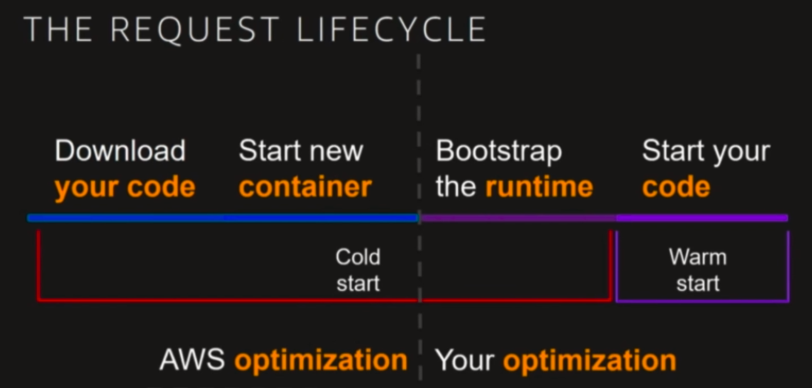
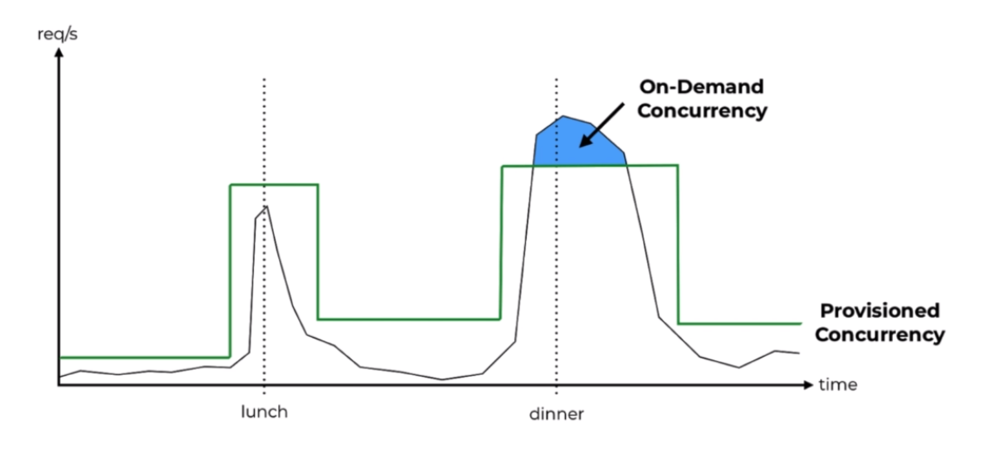

# Lambda Best Practices

----

## Performance
### Tuning function memory
- Pay As You Go model
- Charged based on the **number of requests** for your functions and the **duration**, the time it
- Lambda **counts a request** each time it starts executing in response to an event notification or invoke call, including test invokes from the console
- **Duration is calculated** from the time your code begins executing until it returns or otherwise terminates, rounded up to the nearest 1ms* 
takes for your code to execute. The price depends on the amount of memory you allocate to your function. In the AWS Lambda resource model, you choose the amount of memory you want for your function, and are allocated proportional CPU power and other resources. An increase in memory size triggers an equivalent increase in CPU available to your function.
- The price for Duration depends on the amount of memory you allocate to your function. You can allocate any amount of memory to your function between 128MB and 10,240MB, in 1MB increments.
- **AWS Lambda free usage tier includes 1M free requests per month and 400,000 GB-seconds of 
compute time per month**

- IO bound Lambda - Increasing memory and cpu will not be any use for the performance of the 
function

- CPU bound Lambda - Increasing memory and cpu should increase the performance of the 
function
### Cold starts
- We need to focus on cold duration to optimize it and get better performance

- we can only optimize "Bootstrap the runtime". The more the dependencies we use in our code, the
 more the InitDuration. The InitDuration is available in CloudWatch Logs as well in X-Ray records
#### What affects the Initialization time?
- Loading dependency modules affects the Initialization time
- More memory and CPU does not improve Initialization time during cold start
- [shave-99-93-off-your-lambda-bill-with-this-one-weird-trick](https://hichaelmart.medium
.com/shave-99-93-off-your-lambda-bill-with-this-one-weird-trick-33c0acebb2ea)
- Its faster to load dependencies from a layer than built-in aws lambda environment or through 
artifact itself
- Unused dependencies (through require module) bundled in the artifact do not add to Initialization 
time. But large artifacts affects our regional code storage limit of 75GB. 
- Only explicit require matters. Load explicitly the dependencies that are needed from layers and 
the Initialization time is far better.
 - InitDuration is displayed only during cold start. In subsequent invocations, we get only 
 Duration.
 - Changing the env variable, updating the function, configuration changes - leads to cold start 
 again
 - Move the dependencies to devDependencies. Load explicitly the dependencies in the code and use 
 webpack to produce  minified output file. we dont need to use layers. The Initialization time is drastically improved than layers. 

### Provisioned concurrency
[provisioned-concurrency-the-end-of-cold-starts](https://lumigo.io/blog/provisioned-concurrency-the-end-of-cold-starts/)
- Its about improving user experience, not eliminating cold starts
- When should I use Provisioned concurrency?
    - I can't optimize the cold start any further
    - I have strict latency requirement
    - I am using Java or .NET
    - Traffic is spiky
    - Cold starts would likely stack
    
- provisioned-concurrency example

- Provisioned Concurrency is always provisioned against a version
- When you configure Provisioned Concurrency on an alias, it’s passed to the underlying version
- We can't use with $LATEST alias
- When it comes to rolling out updates to the alias, the alias’ Provisioned 
Concurrency is first removed from the old version, then applied to the new version. This process is not instant as Lambda needs to provision the desired concurrency against the new version.
However, traffic is routed to the new version straight away. This creates a window of time when 
requests against the alias would not fall under any Provisioned Concurrency. it can be mitigated with weighted alias since Provisioned Concurrency is distributed across the two versions according to their respective weight.
- Provisioned Concurrency also works with AWS Auto Scaling, which allows you to configure scaling
actions based on utilization level (think EC2 auto-scaling) or on a schedule (think cron). 
Register the alias as a scaling target for AWS Auto Scaling.
- we can configure a scheduled action to enable Provisioned Concurrency
- Dont use Provisioned Concurrency as default option
### HTTP keep-alive for aws-sdk
- Add this is in env variables section of a lambda function
    - AWS_NODEJS_CONNECTION_REUSE_ENABLED 1
- Else add this in code itself as below 
    - process.env.AWS_NODEJS_CONNECTION_REUSE_ENABLED = 1
- Atleast 70% time reduced in "Duration"
### Process data in parallel(nodejs)
 - Use Promise.all(promises)
 
## Scalability

## Security

## Resilience

## observability

## Cost