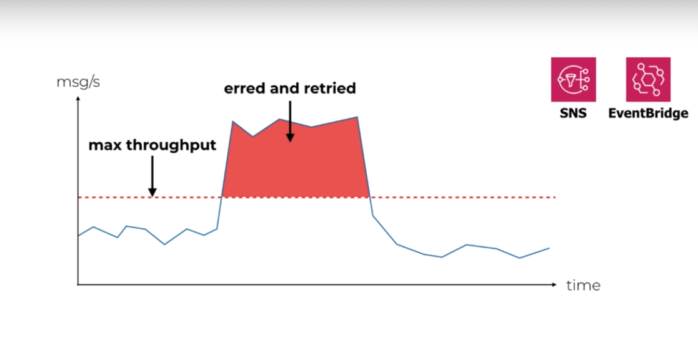

# Lambda Best Practices

----

## Performance
### Tuning function memory
- Pay As You Go model
- Charged based on the **number of requests** for your functions and the **duration**, the time it
- Lambda **counts a request** each time it starts executing in response to an event notification or invoke call, including test invokes from the console
- **Duration is calculated** from the time your code begins executing until it returns or otherwise terminates, rounded up to the nearest 1ms* 
takes for your code to execute. The price depends on the amount of memory you allocate to your function. In the AWS Lambda resource model, you choose the amount of memory you want for your function, and are allocated proportional CPU power and other resources. An increase in memory size triggers an equivalent increase in CPU available to your function.
- The price for Duration depends on the amount of memory you allocate to your function. You can allocate any amount of memory to your function between 128MB and 10,240MB, in 1MB increments.
- **AWS Lambda free usage tier includes 1M free requests per month and 400,000 GB-seconds of 
compute time per month**

- IO bound Lambda - Increasing memory and cpu will not be any use for the performance of the 
function

- CPU bound Lambda - Increasing memory and cpu should increase the performance of the 
function
### Cold starts
- We need to focus on cold duration to optimize it and get better performance

- we can only optimize "Bootstrap the runtime". The more the dependencies we use in our code, the
 more the InitDuration. The InitDuration is available in CloudWatch Logs as well in X-Ray records
#### What affects the Initialization time?
- Loading dependency modules affects the Initialization time
- More memory and CPU does not improve Initialization time during cold start
- [shave-99-93-off-your-lambda-bill-with-this-one-weird-trick](https://hichaelmart.medium
.com/shave-99-93-off-your-lambda-bill-with-this-one-weird-trick-33c0acebb2ea)
- Its faster to load dependencies from a layer than built-in aws lambda environment or through 
artifact itself
- Unused dependencies (through require module) bundled in the artifact do not add to Initialization 
time. But large artifacts affects our regional code storage limit of 75GB. 
- Only explicit require matters. Load explicitly the dependencies that are needed from layers and 
the Initialization time is far better.
 - InitDuration is displayed only during cold start. In subsequent invocations, we get only 
 Duration.
 - Changing the env variable, updating the function, configuration changes - leads to cold start 
 again
 - Move the dependencies to devDependencies. Load explicitly the dependencies in the code and use 
 webpack to produce  minified output file. we dont need to use layers. The Initialization time is drastically improved than layers. 

### Provisioned concurrency
[provisioned-concurrency-the-end-of-cold-starts](https://lumigo.io/blog/provisioned-concurrency-the-end-of-cold-starts/)
- Its about improving user experience, not eliminating cold starts
- When should I use Provisioned concurrency?
    - I can't optimize the cold start any further
    - I have strict latency requirement
    - I am using Java or .NET
    - Traffic is spiky
    - Cold starts would likely stack
    
- provisioned-concurrency example

- Provisioned Concurrency is always provisioned against a version
- When you configure Provisioned Concurrency on an alias, it’s passed to the underlying version
- We can't use with $LATEST alias
- When it comes to rolling out updates to the alias, the alias’ Provisioned 
Concurrency is first removed from the old version, then applied to the new version. This process is not instant as Lambda needs to provision the desired concurrency against the new version.
However, traffic is routed to the new version straight away. This creates a window of time when 
requests against the alias would not fall under any Provisioned Concurrency. it can be mitigated with weighted alias since Provisioned Concurrency is distributed across the two versions according to their respective weight.
- Provisioned Concurrency also works with AWS Auto Scaling, which allows you to configure scaling
actions based on utilization level (think EC2 auto-scaling) or on a schedule (think cron). 
Register the alias as a scaling target for AWS Auto Scaling.
- we can configure a scheduled action to enable Provisioned Concurrency
- Dont use Provisioned Concurrency as default option
### HTTP keep-alive for aws-sdk
- Add this is in env variables section of a lambda function
    - AWS_NODEJS_CONNECTION_REUSE_ENABLED 1
- Else add this in code itself as below 
    - process.env.AWS_NODEJS_CONNECTION_REUSE_ENABLED = 1
- Atleast 70% time reduced in "Duration"
### Process data in parallel(nodejs)
 - Use Promise.all(promises)
 
## Scalability
- Lambda functions are auto-scaled
- Divide-and-Conquer to improve throughput and processing time **(Fan-Out)**
    - In order to split a complex task into sub-tasks and execute by multiple Lambdas, we need a 
    glue to between Lambda which splits the complex task and individual worker Lambdas
    -  SNS, SQS, EventBridge, Kinesis, Step Functions
    - We need to choose based on throughput and cost.
    - For 1 msg/s for a month, 1KB per msg, the cost is : SQS <  SNS < EventBridge < Kinesis
    - For 1000 msg/s for a month, 1KB per msg, the cost is : EventBridge > SNS > SQS > Kinesis
### Concurrency Vs Messages/s

    - For SNS and EventBridge, if number messages increases, the concurrency of Lambda workers 
    also increases linearly
    - For SNS, there is no limit on number of messages published
    - For EventBridge, a soft limit of 4000 messages/s
    - For Standard SQS - Lambda uses long polling. By default, Lambda reads upto 5 batches. If more 
    messages available, it can scale upto 1000 batches. But 60 batches/minute
    - For FIFO queue - Lambda sorts messages into groups based on message group ID and sends only
     one batch at a time for a group. The function scales in concurrency to the number of active 
     message groups.
     - Kinesis - 1 execution per Shard. so concurrency goes up in discrete steps. For each shard we 
     can publish 1000 msgs/s. we can increase the concurrency by processing multiple batches from
     each shard in parallel. Lambda can process upto 10 batches in each shard simultaneously.    

- Fan-Out and Fan-In
    - Model this pattern using Step Functions
    
### Controlling Concurrency
[aws-lambda-concurrency](https://lumigo.io/aws-lambda-performance-optimization/aws-lambda-concurrency/)
- In Lambda, the number of instances that serve the request at a given time is known as Concurrency. 
However, the bursting of these instances cannot be infinite. It starts with an initial burst ranging from 500 to 3000 depending on the Region where Lambda function runs.
- Concurrency limits are defined at two levels:
    - Account – It is by default 1000 for an account per region. It can be extended by requesting if from AWS.
    - Function –  It has to be configured at the level of each function. If not defined, it will use at the account-level concurrency limit.
- We need to control concurrency because the down stream system can't scale like Lambda
- Any excess traffic the downstream can't handle its going to result in error. But SNS will retry
 this failure and eventually succeed.
 
 
- What if the error is sustained for a period of time and even the retry also fails. When retry 
limit is reached, the messages are send to DLQ. If downstream outage happens, then the messages
are send to DLQ.

- If we want **maximum throughput**, then use SNS/EventBridge
- If we want **precise control over throughput**, then use Kinesis

- Any traffic not handled by downstream are amortised and processed later, making sure we dont 
send more traffic to downstream than its allowed by controlling number of Lambda per Shard. we 
can also set **Batch Size (number of records in a batch, max 10000), Batch Window, Concurrent 
batches per Shard**.

Refer [self-healing-kinesis-function-that-adapts-its-throughput-based-on-performance](https://theburningmonk.com/2019/05/a-self-healing-kinesis-function-that-adapts-its-throughput-based-on-performance/)

- The messages will be picked up once the outage is over from where it was left and at max 
concurrency without overwhelming the downstream
- But a single poison message on a shard can prevent all other messages from being processed. To 
avoid it, we can configure **On-failure destination, Retry attempts, Maximum age of record**

### API Gateway Service Proxies

- Lambda has a Hard scaling limit but API gateway has only soft limit
- We should consider service proxies
    - when we are concerned about cold start overhead or burst limit
    - Function does nothing but call AWS service and return response

- What we lose?
    - Retry and exponential backoff
    - Contextual logging
    - Error Handling
    - Fallbacks
    - Tracing
    - Chaos Tools
    
- We need to use VTL (Velocity template mapping between API gateway and AWS Services)

### Load Testing
- Commonly accepted performance for web-applications
    - <100ms - is perceived as instantaneous
    - 100ms - 300ms - perceptible delay
    - 1s - user starts to lose attention
    - 2s - user expects the app to respond by now
    - 3s - 40% users would abandon the site
- Load testing is the right way to find out how well our application performs under load
- Use realistic scenarios for load tests. Match the traffic with real scenarios.
- Incorrect traffic load can lead to sudden burst of Lambdas and might reach the concurrency 
limit and throttles as well
- For load testing, test user journeys. Not individual functions
- Load testing tool [artillery](https://artillery.io/), [serverless-artillery-workshop](https://github.com/Nordstrom/serverless-artillery-workshop)
- [Locust](https://locust.io/)
- Don't forget to load test any asynchronous parts of the system

### Provision concurrency
- It helps to get around the scaling limit of 500 per minute after the initial burst limit. But this costs us

### Handling RDS Connections
- Default RDS configs (connection pool) are bad for Lambda
- Each Lambda handles one request at a time and it can be scaled massively.
- The max open connections should be too low
- The idle connections are not closed after Lambda execution. All these connections are Phantomed
- Server side idle connection time-out is too long. For MySQL it is 8 hours. But the Lambda 
function containeris likely to be garbage collected after 10 mins of idle. So new containers 
would not be able to create connections to RDS cluster as we would have already reached max 
connection limit
- By default, most SQL client libraries create some number of connections in pool. But Lambda 
function will use only one connection and so we will end up in reaching max connection limit  
- Set RDS "wait_timeout" and "interactive_timeout" to 10 mins. Default is 8 hours.
- Increase RDS "max_connections"
- Set the client socket pool size as 1
- Instead of doing all these configurations, we can use AWS RDS Proxy which acts as a Proxy 
between Lambda function and RDS cluster, pools and shares the DB connections 

## Security

## Resilience

## observability

## Cost