# Serverless Microservices Architecture Patterns

-----

## Communication Styles
- Microservices are distributed by nature
- RPC Vs REST
- Synchronous Vs Asychronous
- Blocking and Non-blocking calls
- Dealing with throttling, failure-retries, delays and errors

### 1-to-1 communication microservices patterns
- Sync Request/Response
- Sync Request/Async notification or Async response
- REST or Pub/Sub
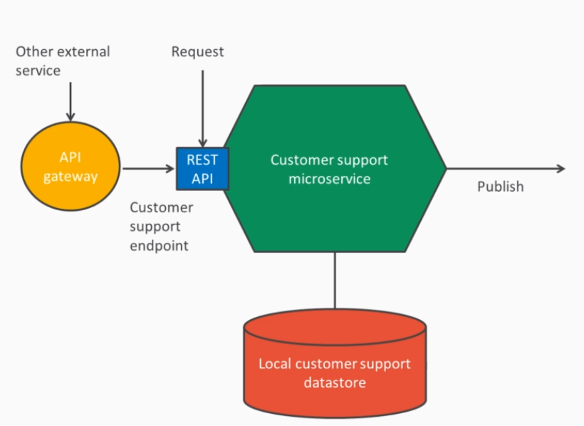

### Many-to-Many communication microservices patterns
- Pub/Sub
- High scalable pattern
- Services are decoupled
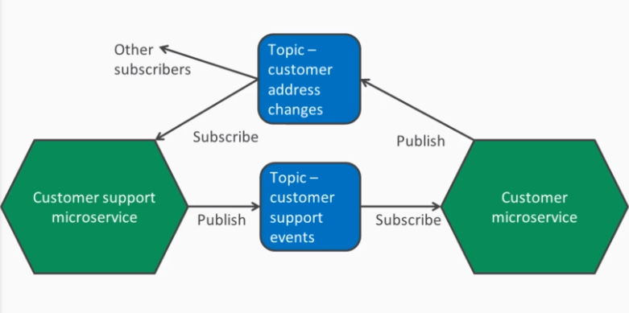

### AWS Lambda Communication patterns
- Data stores sources - Amazon S3 events(async) - Lambda handles retry and sending event to DLQ 
if configured
- Requests to endpoints - API Gateway(sync) - client has to handle retry mechanism
- Changes in repositories and logs - Code commit, CloudWatch
- Event and Message Services - SNS, Cron events
- Streaming event sources - DynamoDB, Kinesis

## Decomposition Patterns
### Decomposition Pattern by Business Capbility
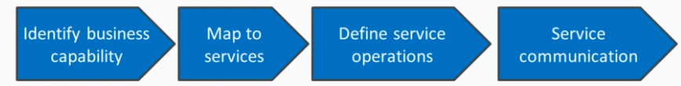
- Benefits:
    - Relatively stable as linked to what business offers
    - Linked to processes and stature
- Drawbacks:
    - Data can span multiple services
    - Might not be optimum communication or shared code
    - Centralized enterprise language model
    - Any change in our service should be propagated to other services.

### Decomposition Pattern by Bounded Context
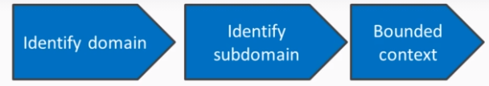
- Benefits:
    - Ubiquitous language
    - Teams own, deploy and maintain services
    - Domain over interface - other services can access the service through this interface
- Drawbacks: 
    - Learning curve
    - Over complex for simple domains
    - Orphaned services

## Serverless Distributed Data Management Patterns
- Lambda functions are stateless which allows us to easily scale-out
- But the state however needs to be maintained outside the Lambda, as an event or in DB.

### DB per Service and Shared DB patterns
#### CAP Theorem for Distributed Data Stores
- Its broken down into 3 different types of guarantees.
    - Consistency(C):
        - Every read receives the most recent write or an error
    - Availability(A):
        - Every request receives a (non-error) response, without the guarantee that it contains the most recent write
    - Partition Tolerance(P):
        - The system continues to operate despite an arbitrary number of messages being dropped (or delayed) by the network between nodes
    
- When a network partition failure happens should we decide to
  
  - Cancel the operation and thus decrease the availability but ensure consistency
  - Proceed with the operation and thus provide availability but risk inconsistency
- The CAP theorem implies that in the presence of a network partition, one has to choose between 
consistency and availability. Note that consistency as defined in the CAP theorem is quite different from the consistency guaranteed in ACID database transactions.
- In the absence of network failure – that is, when the distributed system is running normally – both availability and consistency can be satisfied.
- In a system, different services can adopt either CP or AP.
    - Customer Loyalty Point Service can adopt AP
    - Customer Bank Balance Service needs CP
- DynamoDB allows to select between C(Strongly Consistent) and A(Eventually Consistent)

#### Shared DB pattern
- Many services share a single DB
- Benefits:
    - Simple to understand
    - All data in one place and easy to query using Joins(SQL)
- Drawbacks:
    - Services are tightly coupled to DB of particular type.
    - Schema changes might break other services.
    - Updation of several services if any business logic changes. It results in Low cohesion and 
    we need to avoid.
#### DB per Service pattern
- Services have their own DB
- Services can choose DB based on their use case(SQL or NoSQL)
- Schema changes are easy
- Drawbacks:
    - Fragmentation of Data. If want to query or join across multiple DB tables, this can be 
    slower because we need to go via service REST API. This pattern is called API composition. It
     has impact on performance and leads to latency
    - Teams may have inconsistencies in schema naming conventions and inefficient data storage.
#### Amazon DynamoDB
- Fast, fully managed NoSQL DB
- Highly available and Durable
- In-memory cache via Amazon DynamoDB Accelerator(DAX)
- Simple and Cost effective - pay as you use
- Serverless

#### Amazon Aurora
- Serverless
- Auto-Scaling
- Pay per resource consumption
- Fully managed, Highly available
- Read replicas
- Dynamic resizing upto 64TB

#### Access patterns for DynamoDB
- API Gateway -> Lambda -> DynamoDB
- API Gateway -> DynamoDB 

#### Transaction Log Tailing Pattern
- Publish event when the state changes
- Every committed update is published as an event
- The transaction log processor parses the logs
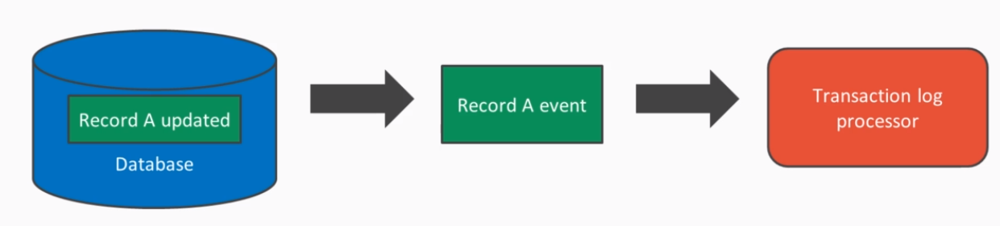

- Implement this pattern using DynamoDB streams
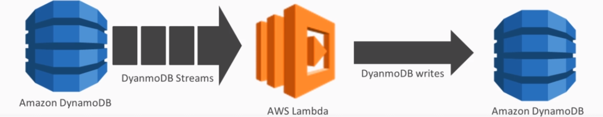

- DynamoDB Stream contents
    - Keys only
    - New Image
    - Old Image
    - New and Old Image
    
#### DynamoDB Security
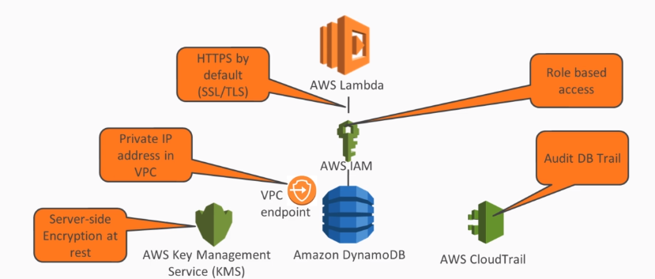
- Communication between Lambda and DynamoDB is HTTPS, Role based access with least privilege.
- By default, Lambda function is executed securely inside a AWS Lambda VPC.  
- We can run functions within our own VPC as well. But we need to create VPC endpoint(Private IP 
address) on the DynamoDB which enables Lambda functions, containers, EC2 instances inside our VPC to communicate 
with DynamoDB, avoiding the traffic to leave outside our VPC.
- Enable Server-side encryption at rest
- Audit DB trail
    
#### Saga Pattern
- Coordinate microservice for read and write transaction operations
- Maintain data consistency
##### Choreography
- Event based pub/sub
- The coordination is handled by microservices itself and each microservice needs to have 
business logic to handle it
- Services are loosely coupled

##### Orchestrator
- The orchestrator coordinates all the microservices together and logic is centralised
- Event based
- Amazon Step Function provides a state machine which can be used to orchestrate the flow.

## Accessing Relational Database Serverless Patterns
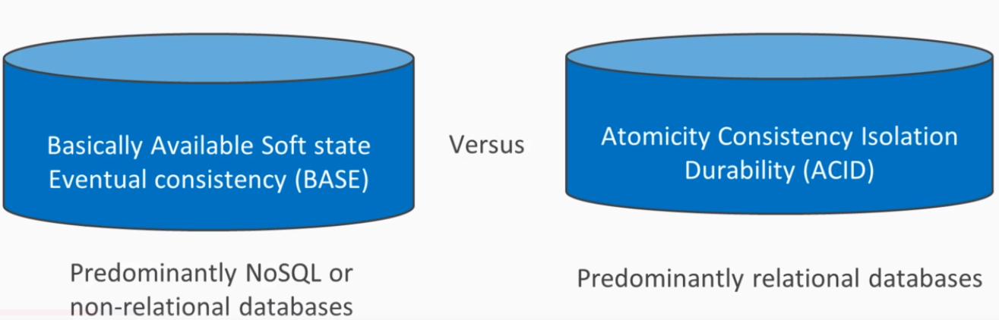

### Access RDS from local

### Access RDS from API gateway, Lambda
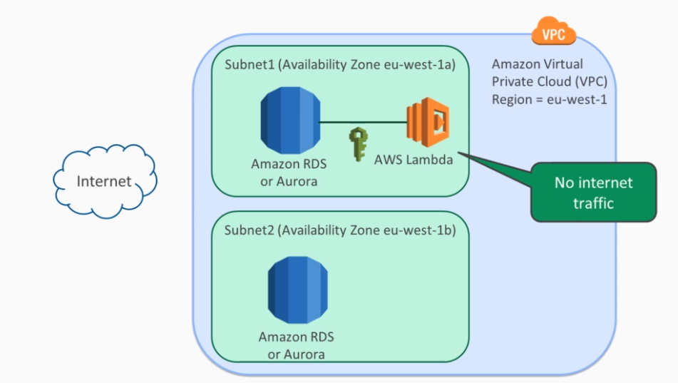
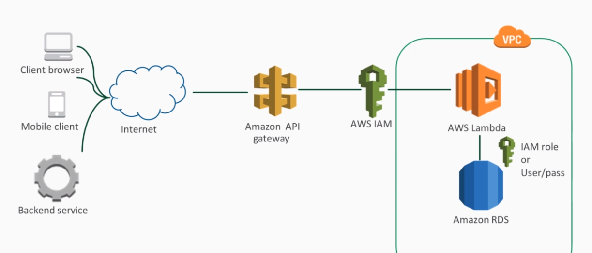
- RDS is restricted to maximum of 5 replicas
- Replication is slower, it takes seconds

### Access Aurora API gateway from Lambda
- Aurora supports maximum of 15 replicas
- Replication is faster, it takes milli-seconds
- Aurora has 2 endpoints by default - Write and Read replicas

### Securing RDS and Aurora Databases
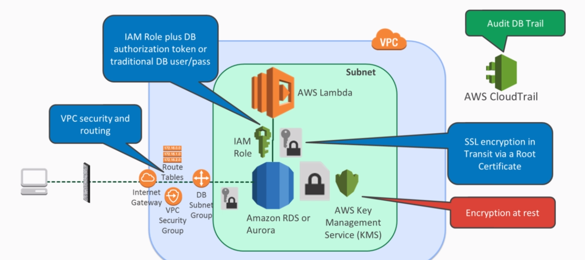
- By default, Lambda->DB, the data is not encrypted at transit

## Serverless Query and Messaging Patterns
### API Gateway Pattern
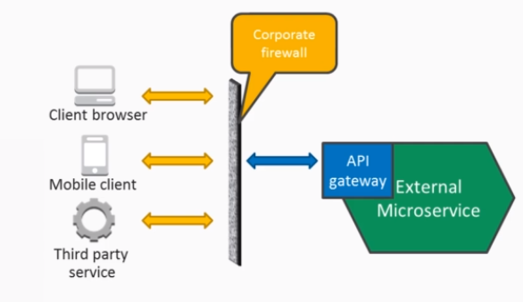
- External facing API
- Responsible for routing
- Reduce call latency through caching
- Authentication
- Abstracts fine-grained microservice APIs

#### Implementing API Gateway pattern
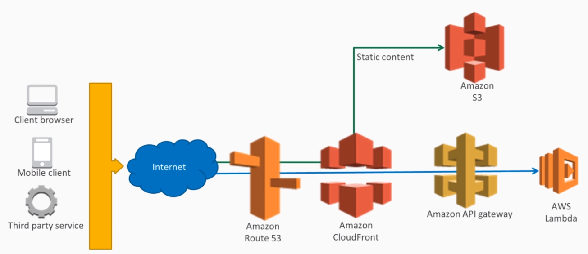

### API Composition Pattern
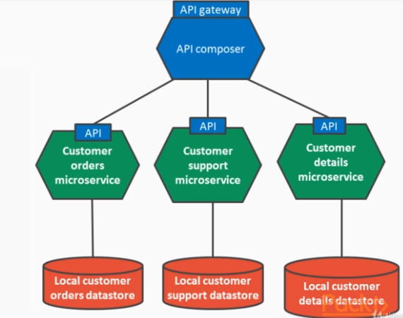
- Retrieve data from multiple services
- Invoke services that own data
- Joins the data in-memory
- Recommendations:
    - Invoke services in parallel if there are no dependencies
    - Monitor latency 
- Drawbacks:
    - Impact on query latency    
    - It has effect of reducing the availability of the system since it depends on many APIs and 
    it's brittle
    - Weaker consistency as it introduces another level processing the data and thus introducing 
    the delay
    - Not suitable for large amounts of data
    - Scalability issue on many calls

- So the much preferred pattern is CQRS

#### Implementing API Composition Pattern
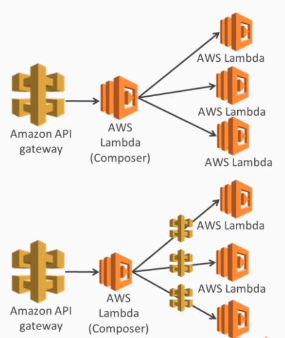

### Event Sourcing Pattern
#### Database Persistence Challenges:
- DB stores only the current state
- No audit trail or history of CRUD operations
- Lack of generic support to push event changes to other services

#### Synchronization Persistence Challenges:
- Table growth for shared DB - scale vertically and horizontally
- Indices, Clustering and Load balancing
- Avoid single of point of failure for master - HA

#### What is Event Sourcing
- The fundamental idea of event sourcing is that of ensuring every change to the state of an 
application is captured in an event object and that these events are themselves are stored in the
 sequence they were applied for the same lifetime as the application state itself
- Action or state change is an event
- Event is immutable
- Events can only be appended to the sequence or event store. This avoids many concurrency 
issues, it makes sure that services accessing it are non-blocking and can scale out to many.
- We can recreate the current state or aggregate views by replaying events
- Communicates data changes between services
- The event store can contain - |event_id|event_type|entity_type|entity_id|event_data|
##### Benefits
- Preserves history of events and log all changes
- Recreate different projections or views on data
- Notify other subscriber services of data changes
##### Drawbacks 
- Learning curve compared to CRUD
- Additional complexity of message-based applications and evolving events. A simple shared DB is 
easy to implement than event sourcing and event store
- Querying and maintaining an event store is different programming and administrative paradigm

### CQRS Pattern (Command Query Responsibility Segregation)
- CQRS is simply the creation of 2 objects where there was previously only one. The separation 
occurs based upon whether the methods are a command or query. Its essentially the division of 
read and write methods
- The command are the methods that takes a new event and does not return any data
- The query are the methods that return data with no side effect.

#### CQRS Architecture
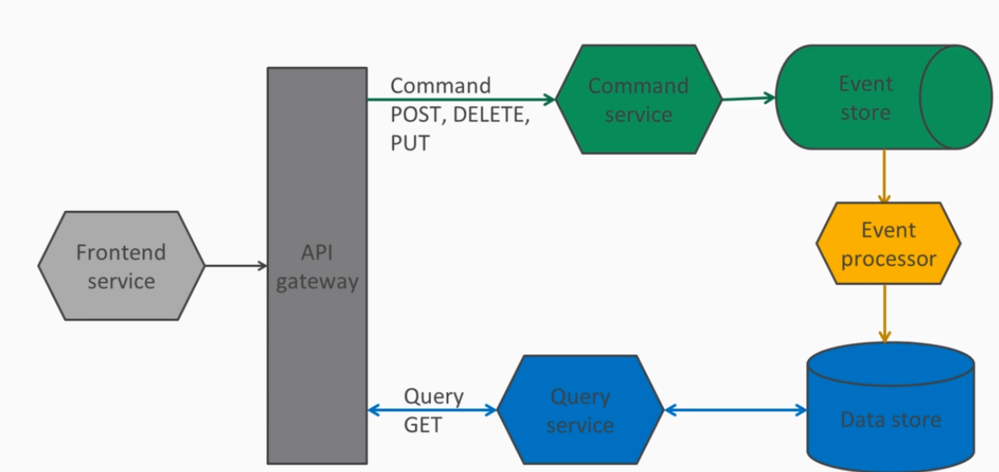

##### Benefits
- Separate domain model for Command and Query
- Flexible, Non-blocking
- Polygot
##### Drawbacks
- Eventually consistent
- Side effect of event replay
- Complex for simpler products over CRUD
- Identify correct bounded contexts or services

### Architectures of the Serverless Event Sourcing Pattern
#### Event sourcing using Kinesis Streams
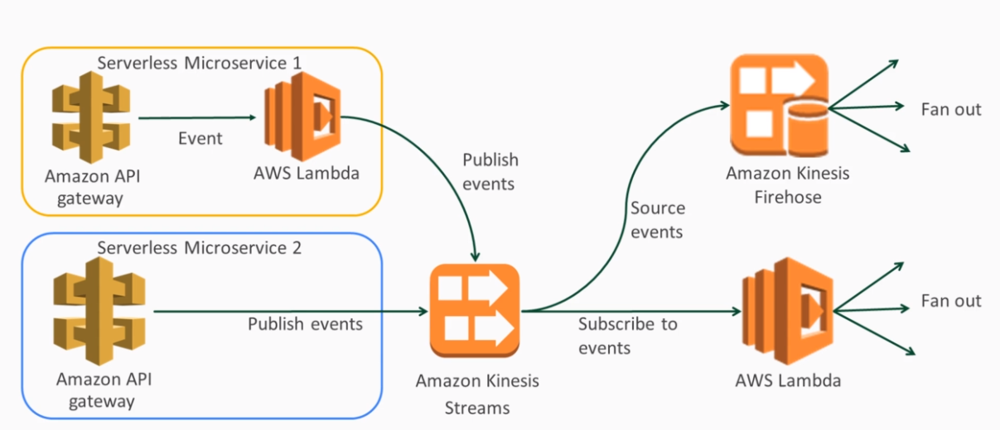

##### Benefits
- Kinesis streams invokes the Lambda with data batches in sequence. Concurrency of Lambda depends
 on number of shards in Kinesis
 - At least once delivery semantic
 - Highly scalable, data from up to 7 days can be replayed

##### Drawbacks
- Manual scaling
- Possible duplicate records, for example, producer retries - consumer needs to handle duplicates

#### Event sourcing using DynamoDB
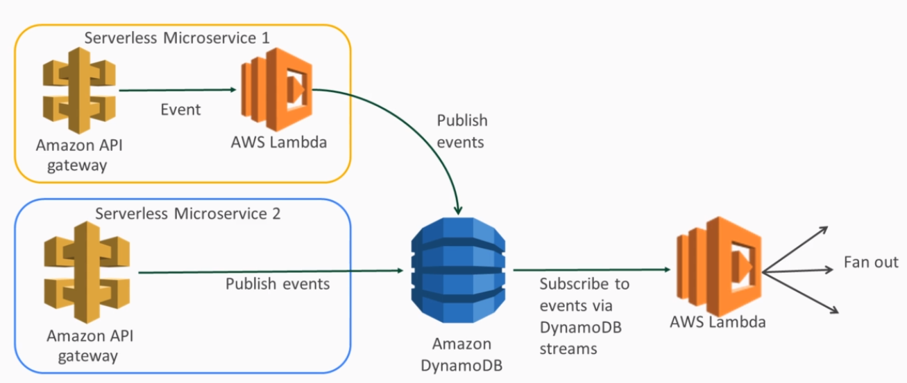

##### Benefits
- DynamoDB streams invokes the Lambda with data batches in sequence.
- Rich update expression set, remove, add, delete possible de-duplicate data as written
- Auto scaling and do not pay for streams
- Replay stream upto 24 hours

##### Drawbacks
- Streams data are only held for 24 hours
- Expensive at scale for write capacity
- Auto scaling at web scale could lead to Lambda throttles
- 256KB record size

#### Event sourcing using SQS
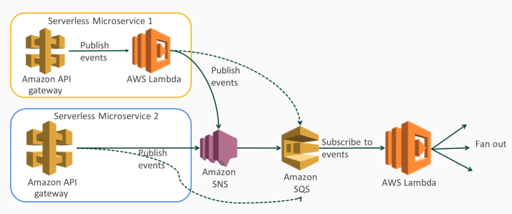
- SNS -> Lambda  => Lambda will be invoked per event from SNS which is not scalable way of doing 
things. So, SNS -> SQS -> Lambda

##### Benefits
- FIFO and content based de-duplication
- Auto scaling
- Messages stay upto 14 days if not deleted

##### Drawbacks
- One message can be consumed by only one consumer.
- No ability to replay
- 256KB message size
- Once deleted, not able to replay

#### Comparison
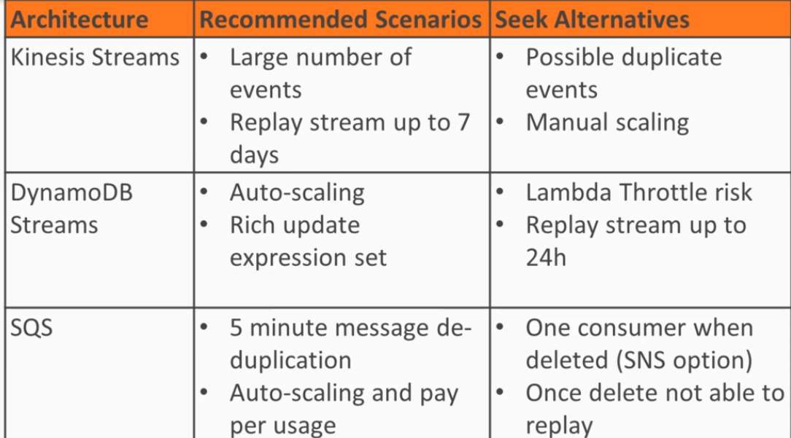

### Architectures of Serverless CQRS pattern
- 4 different patterns available
#### CQRS using Aurora Serverless
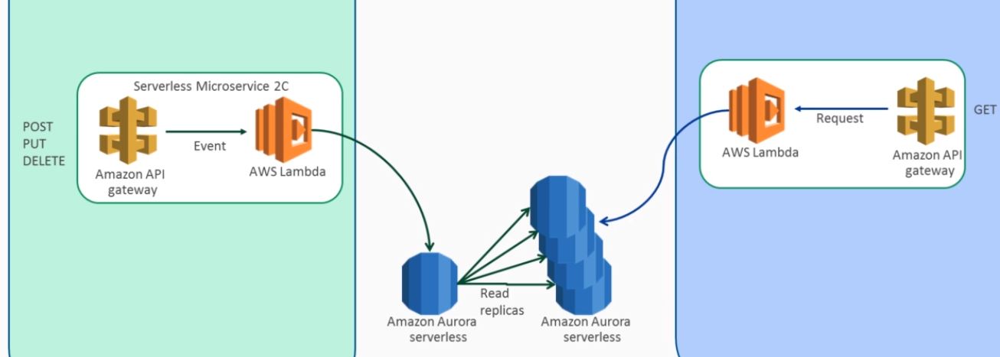

##### Benefits
- SQL query
- Auto scaling disk
- Read replicas provided with cluster

##### Drawbacks
- Not strictly speaking CQRS as no event processor
- No ability to replay stream from Aurora
- No direct integration with API Gateway

#### CQRS using DynamoDB
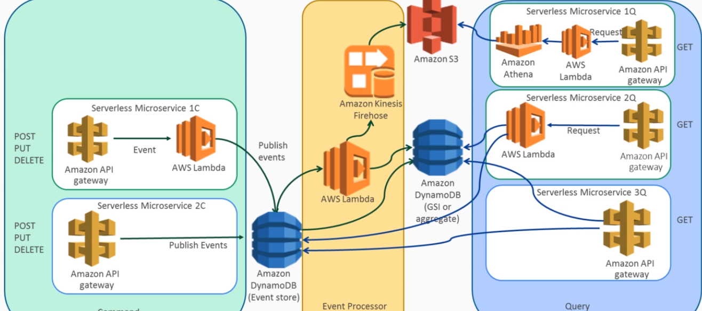

##### Benefits
- DynamoDB streams invokes the lambda with data batches in sequence
- Rich update expression set, remove, add, delete possible to de-duplicate data as written 
- Auto scaling and do not pay for streams
- Global Secondary index or lambda projected or aggregate table

##### Drawbacks
- Streams data are only held for 24 hours
- Expensive at scale for write capacity
- Auto scaling at web scale could lead to Lambda throttles
- 256KB record size

#### CQRS using SQS
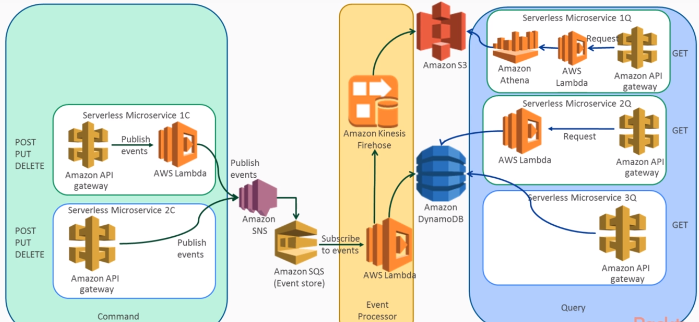

##### Benefits
- FIFO 
- Exactly once processing via 5 minute content based de-duplication
- Option to use SNS to further fan out

##### Drawbacks
- No replay once message deleted
- One message can be consumed by only one consumer

#### CQRS using Kinesis
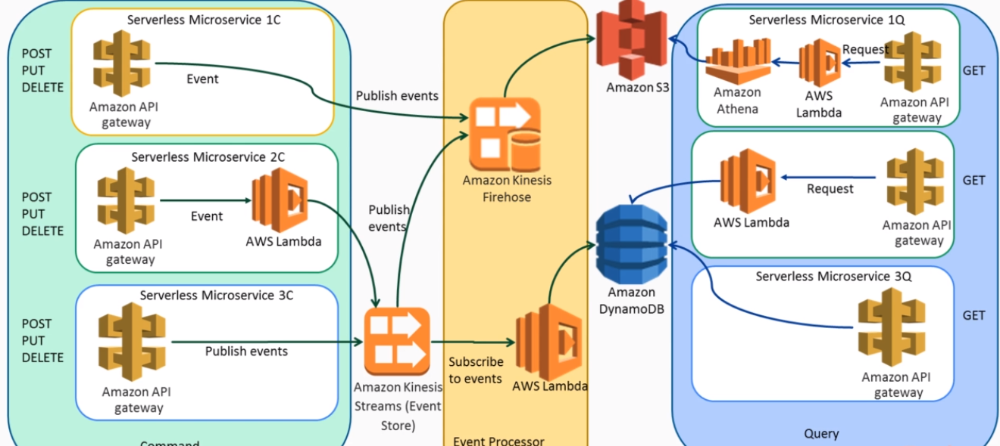

##### Benefits
- Replay events
- Huge writes capacity at 1000/s per shard
- Built-in integration with API gateway and lambda
- Many consumers

##### Drawbacks
- Data is not stored permanently and stored only for 7 days. But we can store in S3 and replay later
- Manual scaling - increase the shards
- Read capacity - number of consumers increase if shards increase

### Securing Event Streams and Queries
#### IAM Roles and Policies
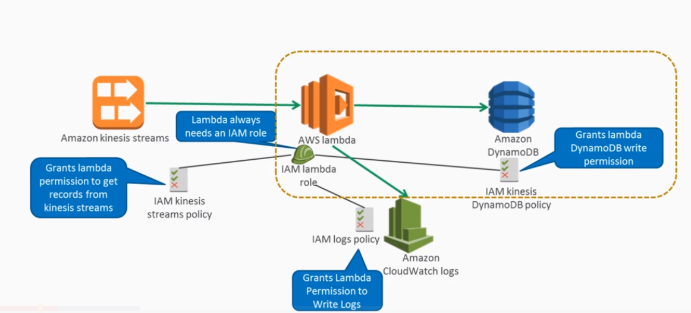

- Kinesis streams to Lambda security
- DynamoDB streams to Lambda security
- SQS to Lambda security
- Firehose to S3 security
- API Gateway to DynamoDB security
