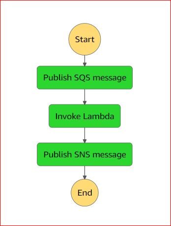
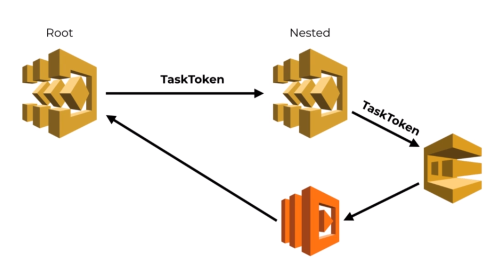

# Step Functions

---

- It is a Orchestration Service that allows you to model workflows as state machine
- Manages the state of the workflow, keeps track of the execution, scalable and resilient
  platform.
- Design state machine using JSON. Refer the spec [states-language](https://states-language.net/)
- Multiple executions of same state machine can be executed concurrently
- Start state machine:
  - ```javascript 1.8
    StepFunctions.startExecution(req).promise();
    ```
  - API Gateway
  - CloudWatch Events
- The states in the state machine can invoke Lambda function
- Step Functions can record upto 25K events in Execution Event History per execution

### Terminology

- Every time the execution moves on from one state to another, it's called a **state transition**
- Step Functions charges based on number of state transitions across all your state machines, including retries.
- 4,000 free state transitions per month and does not automatically expire at the end of your 12 month AWS Free Tier term, and is available to both existing and new AWS customers indefinitely.
- $0.025 per 1,000 state transitions. $25 for 1M state transitions. $0.000025 PER STATE TRANSITION
  THEREAFTER
- State Machine Definition is the workflow created using JSON spec
- State Machine status:
  - Running
  - Succeeded
  - Failed
  - Timeout
  - Aborted
- Each state machine has an unique ARN and IAM role which is needed to interact with Lambda and
  other AWS services
- Each execution has an unique ARN, start time, end time, input and output, status
- Each state in the execution has a status:
  - Success
  - Failed
  - Cancelled
  - In Progress
- Each state displays input, output, exception if any
- Each state can have Retry, Catch, Timeout configured in the workflow
- CloudWatch has metrics for Step Functions based on status

### When to use Step Functions?

- Pros
  - Visual workflow
  - Error handling
  - Audit
- Cons
  - Cost - $25 for 1M state transitions
- Scenarios
  - Business critical workflows - stuffs that make money. Eg: Payment, subscription - More
    robust error handling worth the premium
  - Complex workflows - Many states, branches, etc - visual workflow is a powerful design(for
    product) and diagnostic tool(for customer support)
  - Long running workflows - runs >15 mins - AWS discourages recursive Lambda functions. Step
    Functions gives you explicit branching checks, and can timeout at workflow level
  - Workflows within a bounded context of a single microservice are often orchestrated using a
    series of Lambda functions with Kinesis or SNS or SQS messages in between. Its good practice
    to use events to interact with different microservices together not within the same service.
    Because the workflow itself doesn't exist as a standalone concept anyway, but merely exists
    as the sum of a bunch of loosely connected functions with event sources. This makes the
    workflow to reason about and debug. we can't implement workflow level timeout as well. If you
    have such a system now, it should be moved to Step Functions

### 8 Types of States

#### Task

- Performs a task
- ```json
      "TaskState":{
        "Type":"Task",
        "Resource":"ARN",
        "Next":"AnotherTask",
        "TimeoutSeconds":"300",
        "ResultPath":"$.n"
      }
  ```
- ARN can be of Lambda, Activity, AWS Batch, ECS Task, DynamoDB, SNS, SQS, AWS Glue, SageMaker
- `TimeoutSeconds` - default is 60s. State machine doesn't know about the timeout of Lambda
  function. If TimeoutSeconds < Lambda function timeout, then this task will be timed out after
  TimeoutSeconds. so its good to set TimeoutSeconds = function's timeout
- If `ResultPath` is not specified, then the output from the state would bind to the $ symbol
  and override the current execution state. If we don't want this behaviour, you can bind the
  result to a path on the execution state, like, $.n

#### Pass

- Passes Input to Output without doing any work. It can modify the execution state.
- ```json
      "PassState":{
        "Type":"Pass",
        "Result":{
          "value" : 42
        },
        "ResultPath":"$.storeResult",
        "Next":"AnotherTask"
      }
  ```
- `Result` - we can specify output for the pass state and we can say where to store the results
  in execution state using the `ResultPath` attribute. If the Pass state as empty Input, then
  the output will look like
  ```json
  {
    "storeResult": {
      "value": 42
    }
  }
  ```


#### Wait

- Wait before transitioning to next state
- Set the static value
- Can wait for max 1 year

- ```json
      "waitStateUsingSeconds":{
        "Type":"Wait",
        "Seconds":10,
        "Next":"AnotherTask"
      }
  ```
- ```json
      "waitStateUsingTimeStamp":{
        "Type":"Wait",
        "TimeStamp":"2021-07-14T01:59:00Z",
        "Next":"AnotherTask"
      }
  ```
- To dynamically set the value
- ```json
      "waitStateUsingSeconds":{
        "Type":"Wait",
        "SecondsPath":"$.waitTime",
        "Next":"AnotherTask"
      }
  ```
- ```json
      "waitStateUsingTimeStamp":{
        "Type":"Wait",
        "TimeStampPath":"$.waitUntil",
        "Next":"AnotherTask"
      }
  ```

#### Choice

- Adds branching logic to the state machine

- ```json
      "choiceState": {
        "Type": "Choice",
        "Choices": [
          {
            "Variable": "$.name",
            "StringEquals": "Neo",
            "Next": "BlueTask"
          },
          {
            "Variable": "$.name",
            "StringEquals": "Alpha",
            "Next": "GreenTask"
          }
        ],
        "Default": "RedTask"
      }
  ```
- Using And

- ```json
        "choiceState": {
          "Type": "Choice",
          "Choices": [
            {
              "And": [
                {
                  "Variable": "$.name",
                  "StringEquals": "Neo"
                },
                {
                  "Variable": "$.isRescued",
                  "BooleanEquals": true
                }
              ],
              "Next": "BlueTask"
            }
          ],
          "Default": "RedTask"
        }
  ```
  

#### Parallel

- Performs tasks in Parallel
- The state will complete when all of the branches have finished or one of them have failed
- - If any of the branches ends in a failure, it immediately "Cancels" the whole Parallel State, even if some of the branches are already in-progress/waiting. The states are marked as `Cancelled`
- If any of the branches ends in a failure, then the whole Parallel state would end in Failed state
- We can transition to the states within a specific branch of Parallel State. We can't transition from a branch to a state in another branch of Parallel State
- We can't duplicate the state names across the state machine. So state name should be unique.
- The output of Parallel State is combined output of all branches and collected into an array and follows the same order as the branches
- Parallel states can be nested

- ```json
    "parallelState": {
      "Type": "Parallel",
      "Branches": [
        {
          "StartAt": "Add",
          "States": {
            "Add": {
              "Type": "Task",
              "Resource": "ARN",
              "End": "true"
            }
          }
        }
      ],
      "Next": "RedTask"
    }
  ```
  

#### Succeed

- Terminates the State Machine execution successfully
- Task, Pass, Wait and Parallel - Allows to terminate the execution when they are complete but not
  the Choice state, in which case we might need to have a state that represents a successful
  termination for the execution. This is the purpose of Succeed State
- ```json
    "succeedState": {
      "Type": "Succeed"
      }
  ```

#### Fail

- Terminates the State Machine execution and mark it as failure
- We must specify an attribute `Error` and `Cause`
- Fail States are terminal state, so we can't specify additional state transition with `Next`
- ```json
    "failedState": {
      "Type": "Fail",
      "Error": "InvalidInput",
      "Cause": "Supplied Input is Invalid"
    }
  ```

#### Map

- [dynamic-parallelism](https://aws.amazon.com/blogs/aws/new-step-functions-support-for-dynamic-parallelism/)
- Step Functions supports a new `Map` state type for dynamic parallelism
- To configure a Map state, you define an `Iterator`, which is a complete sub-workflow. When a Step Functions execution enters a Map state, it will iterate over a JSON array in the state input. For each item, the Map state will execute one sub-workflow, potentially in parallel. When all sub-workflow executions complete, the Map state will return an array containing the output for each item processed by the Iterator.
- Control concurrency - Map executes by adding the `MaxConcurrency` field. The default value is 0, which places no limit on parallelism and iterations are invoked as concurrently as possible. A `MaxConcurrency` value of 1 has the effect to invoke the Iterator one element at a time, in the order of their appearance in the input state, and will not start an iteration until the previous iteration has completed execution.
- One way to use the new Map state is to leverage fan-out or scatter-gather messaging patterns in your workflows
- Map supports `Retry and Catch` fields to handle service and custom exceptions. You can also apply Retry and Catch to states inside your Iterator to handle exceptions. If any Iterator execution fails because of an unhandled error or by transitioning to a Fail state, the entire Map state is considered to have failed and all its iterations are stopped. If the error is not handled by the Map state itself, Step Functions stops the workflow execution with an error.


### Managing Execution State

- The input to the state machine execution is bound to execution state $
- When the Lambda function is invoked, we get the current execution state $ as input in the
  function.
- The returned value from the function is updated to the execution state if `ResultPath` id
  defined in the state

- ```json
      "TaskState":{
        "Type":"Task",
        "Resource":"ARN",
        "InputPath":"$.n"
        "End": true
      }
  ```

- By default, the state gets the current execution state as its input. But we can be more
  selective by using `InputPath`. Here $.n selects only the attribute n from the current
  execution state

### Error Handling

- Retry failed states
- Catch any failures that could not be fixed by Retry or wasn't in the scope of Retry, then take
  to different path
- Retry and Catch are only allowed on **Task and Parallel States**
- Both Retry and Catch can be configured against specific error types and there many predefined
  errors
- Predefined error codes
  - States.ALL - matches any error
  - States.Timeout
  - States.TaskFailed
  - States.Permissions
  - States.ALL
- States may report errors with other names, which must not begin with the prefix `States`

- ```json
     "TaskState": {
       "Type": "Task",
       "Resource": "ARN",
       "Next": "AnotherTask",
       "TimeoutSeconds": "300",
       "ResultPath": "$.n",
       "Retry": [
         {
           "ErrorEquals": [
             "ErrorA",
             "ErrorB"
           ],
           "IntervalSeconds": 1,
           "BackoffRate": 2.0,
           "MaxAttempts": 2
         },
         {
           "ErrorEquals": [
             "ErrorC"
           ],
           "IntervalSeconds": 5,

         }
       ],
       "Catch": [
         {
           "ErrorEquals": [
             "States.ALL"
           ],
           "Next": "GoToFailHandlerTask"
         }
       ]
     }
  ```

  

- `MaxAttempts` - default is 3. If set 0, it will never retry
- Each `Retrier` in `Retry` keeps track of its own retry count
- The Error object returned from `Retrier` after the `MaxAttempts` and when there is a `Catch` for that Error, then the Error object becomes the `Output` of previous State and `Input` to the Next state mentioned in `Catch`.
- The Error object returned from `Retrier` after the `MaxAttempts` and when there is no `Catch`, then the Error object becomes the `Exception` of previous State and `Output` of previous State is Empty

### Service Limits

- Steps Functions has below Hard Limits
  - Max open executions - 1M
  - Max execution time - 1 year
  - Max execution history size - 25K events
  - Max execution idle time - 1 year
  - Max execution history retention time - 90 days
  - Max task execution time - 1 year
  - Max time step function keeps the task in Queue - 1 year
  - Max activity pollers per ARN - 1000 pollers
  - Max input or result data size for a task, state, or execution - 32KB
- Steps Functions has below Soft Limits
  - API limits on Step Function APIs. we can't make too many API requests in short time.
- If execution needs to be passed >32KB, then store the data in S3, DynamoDB,etc and pass the key
  to the state machine. The Lambda can fetch using the key

### Monitoring and Debugging

- CloudWatch metrics available and set alarms
- List of executions for a given state machine is available in Step Functions console
- Visualization tool, Execution Event History
- In CloudWatch Events, create a rule to automate an action when the execution failed or timeout or
  succeeded

### Express workflows

- Operates at higher throughput and
- Pros
  - Cost
  - Error Handling
- Cons
  - No Audit
  - No Visual tool
- [standard-vs-express](https://docs.aws.amazon.com/step-functions/latest/dg/concepts-standard-vs-express.html)

### Step Functions now supports AWS PrivateLink

- A Lambda function can be configured to access VPC resources. Even the Subnets and SGs can be
  selected for the function to use to setup the VPC configurations
- When we enable VPC for the function, it loses internet access by default. If Lambda function
  requires internet access, make sure the VPC has NAT Gateway and the SG associated with function
  has OutBound connections allowed
- AWS Private Link(VPC Endpoint) enables the services inside the VPC to connect to Step Functions
  without leaving the VPC. All the traffic are inside AWS network. The VPC endpoint is an ENI and so
  Security Group can be configured on it. This SG should allow inbound connections from Source SG to
  which the Lambda function has been configured.
- If Lambda still has issues in accessing the Step Functions, check NACL rules in the VPC. It
  should be configured to allow both inbound and outbound traffic
- Inorder to keep the traffic inside the AWS network, we can use VPC endpoint over NAT Gateway

### Deploying Step Functions

- Using Serverless Framework, AWS CloudFormation
- When SF(say, sf1 is added in serverless.yml) is deployed, it gets a unique ARN. The exeecutions of sf1 shows the Definitions of sf1 as well
- When new SF(say, sf2 is added and sf1 is removed from serverless.yml) is deployed, sf2 gets a unique ARN but it removes the sf1 and its executions which was deployed previously.
- When SF(say,sf2) is modified and deployed, sf2 retains the previous ARN but gets newly modified definition

### API Gateway and Step Functions

- State Machine can be invoked from API Gateway using POST method. The payload of POST method is the input to State Machine.
- The output of State Machine is not available as API Gateway response.
- Refer [serverless-step-functions-api-gateway](https://www.serverless.com/plugins/serverless-step-functions#api-gateway)


### SNS & SQS and Step Functions

- SNS, SQS is supported by Task Type
- The value of `Resource` attribute for AWS services is per the pattern

  ```
  arn:partition:states:region:account:servicename:APIname

  For SNS, arn:aws:states:::sns:publish
  For SQS, arn:aws:states:::sqs:sendMessage

  ```

- Configure the `Parameters` section for the AWS services to connect. The attributes of `Parameters` section is AWS Services specific.

  ```yaml
  Resource: arn:aws:states:::sns:publish
  Parameters:
    TopicArn: arn:aws:sns:#{AWS::Region}:#{AWS::AccountId}:stepfunction-test
    Message: '{"answer" : 100}'
  ```

  

  ```yaml
  Resource: arn:aws:states:::sqs:sendMessage
  Parameters:
    QueueUrl: https://sqs.#{AWS::Region}.amazonaws.com/#{AWS::AccountId}/stepfunction-test-queue
    MessageBody.$: $.inputMessage
    MessageAttributes:
      foo:
        DataType: String
        StringValue: bar
  ```

  

  ### CallBacks in Step Function

  - For Activities in Step Function, we should have Task Poller implemented by us
  - With CallBacks, we can complete the Task and send success response to State Machine using `sendTaskSuccess(output,taskToken)`
  - The CallBack feature is available for Lambda, ECS, Fargate, SQS, SNS, Step Functions
  - This feature is available by adding a suffix `.waitForTaskToken` to the `Resource`
  - We can perform operations in a event-driven way
    

### Nested Workflows

- Fire and Forget - Parent SF Fires and Forgets the Nested SF. Parent SF doesn't wait for completion of Nested SF. Nested SF needs to take care of its Retry, Error Handling. Any errors in Nested SF doesn't affect the execution of Parent SF
- Synchronous - Parent SF starts and waits for the completion of Nested SF. Parent SF can capture the output, errors of Nested SF and retry. Use the suffix `.sync` for `Resource`
- Callback:
  - Use the suffix `.waitForTaskToken` for `Resource`
    

### Blue-Green Deployments

- State Machine executions are Immutable. Once its running, its going to continue with the original definition even if we update the definition. The problem is when an execution (using original definition) refers a Lambda function(assume always latest in `Resource`) in a Task and both definition, Lambda function are updated, if the Lambda brings a breakable change, then the ongoing execution would fail. To avoid this, we can use specific version of a lambda in `Resource`
- The Serverless Framework provides an attribute `useExactVersion` : true which can be used in State Machine configuration

### Best Practices

- Use Timeouts to avoid getting stuck - Task level, State Machine level TimeoutSeconds
- Store data in S3 instead of passing large payloads
- Handle Service Exceptions - Lambda, other services, make things more robust by handling exceptions
- When using Activities, make sure to use multiple Activity Pollers. If few Pollers are used, then they might not be able to catch up the new tasks and tasks might timeout
- Setup alerts on Step Functions metrics like ExecutionsTimedOut, ExecutionsFailed, ExecutionsAborted, ExecutionsThrottled

### Design Patterns

#### try-catch

- Retry, Catch can be applied to Task, Parallel, Map states
- Wrap multiple states in a single Catch clause to make it easier to apply common error handling logic
- Use Parallel state as wrapper for many states and have a single Catch at Parallel State

#### recursion

- If we need to perform a long running tasks, then Lambda timeout will not support it. So Lambda can execute partially and complete the remaining tasks recursively.
- Its better to execute long running tasks on ECS or Fargate instead of this pattern. The output of ECS and Fargate should be stored in DB and the next state in State Machine can fetch the output from DB

#### sagas

- Managing failures in distributed microservices transaction
- In State Machine, for each action(State) we can have an opposite compensating action

#### de-dupe

- Dont want to process the same input more than once
- StartExecution action is Idempotent. If StartExecution is called with the same name and input as a running execution, the call will succeed and return the same response as the original request. If the execution is closed or if the input is different, we receive 400 ExecutionAlreadyExists error, then its duplicate and we can ignore
- Have a consistent way to derive the execution name from the input
- Execution names can be reused after 90 days

#### Semaphore

- Need to limit number of concurrent state machine executions
- If a state in the flow needs to have limit on concurrency, then introduce semaphore, say a counter in DynamoDB table. While acquiring the semaphore, increment the counter conditionally(if count <3). After performing the action, release the semaphore and atomically decrement the counter in DynamoDB table
