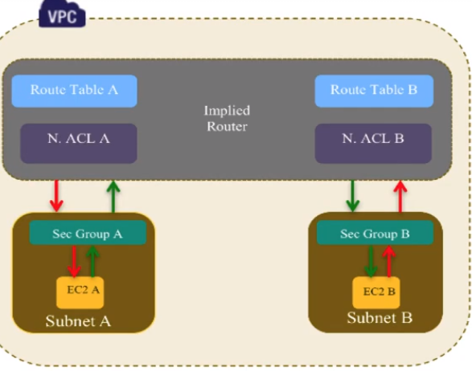
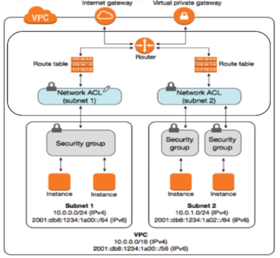

# AWS VPC

-----

- VPC is a Virtual Private Cloud lets us to launch AWS resources in a logically isolated virtual 
network
- VPC is confined to one REGION. It can't extend beyond an aws region.
- Each VPC has main Route table

### VPC Types
- Default VPC
    - Created in each region when an AWS account is created
    - Has default CIDR, Security Group, NACL and Route table settings
    - Has an Internet Gateway by default
- Custom VPC
    - An AWS account owner creates custom vpc in a region
    - AWS user creating the custom VPC can decide the CIDR 
    - Has default Security Group, NACL and Route table settings
    - No default Internet Gateway. We need to create it.
    
### VPC Security Groups
- vNic on VM is known as ENI(Elastic Network Interface) on EC2 instances
- Security Groups are virtual firewall is a line of defence that allows/deny traffic in/out of 
EC2 instance level, specially at vNIC level
- Security Groups are applied at ENI level
- Security Groups control Inbound and Outbound traffic on ENI
- Inbound means traffic coming from outside the instance. Outbound means traffic going out of the 
instance.
- We can have upto 5 SGs per EC2 instance interface at the same time
- SGs is **STATEFUL** - if inbound is allowed, then return traffic is allowed automatically, even 
if there are no explicit rules to allow it.
- SGs permit only **ALLOW** rule. we can't configure **DENY** rule.
- SGs has a implicit **DENY** rule at the end. If configured **ALLOW** rules don't match, 
then this implicit **DENY** is executed
- All rules are evaluated to find a **ALLOW** rule
- We can use a SG name as source or destination in other SG rules
- We can use SG name as a source in its own inbound SG rules
- SGs are Directional - Inbound or Outbound. Based on the direction, rules will have an impact
- Each VPC will have default SG which we can't delete.
- EC2 instances created without specifying SG(during its creation time), will be assigned the 
VPC's default SG
- SGs are VPC resources. Hence different EC2 instances in different AZs, belonging to same VPC, 
can have the same SG applied to them. Other VPCs can't use the SGs from belong to our VPC
- We can use different multiple SGs to the instances in a subnet
- Changes to SGs take effect immediately

#### Default Security Groups Configuration
- Inbound rules allowing instances assigned the same SG to talk to one another
- All outbound traffic are allowed

| S/D  	|   Protocol	|  Port 	|  Rule 	|   	|
|---	|---	|---	|---	|---	|
|  Inbound Source (same SG) 	|   All	|   All	|   ALLOW	|   	|
|  Outbound Destination(0.0.0.0) 	|  All 	|  All 	|  ALLOW 	|   	|

#### Non Default Security Groups Configuration
- No Inbound rule - basically all inbound traffic are denied. Because of implicit DENY rule
- All outbound traffic are allowed

- Question: To allow EC2 instances assigned to a SG to communicate with one another
    - Create a SG, apply to all the EC2 instances and configure rule that allows any traffic, on 
    any protocol/ports, the source of which is the SG itself
    
- Question: To allow EC2 instances on a subnet to communicate with one another
    - Create a SG, apply to all the EC2 instances and configure rule that allows any traffic, on 
    any protocol/ports, the source of which is the SUBNET itself. If we configure source as SG, 
    then it will end up in receiving traffic from other subnets using this SG.

- One subnet can have one Route table at time. 
- The route table of any subnet have CIDR pointing to local target and All subnets within a VPC can 
talk to each other without a problem

### VPC NACL(Network Access Control List)

- NACL is a function performed on the implied router.
- It functions at the subnet level
- NACLs are **stateless** - Outbound traffic for an allowed inbound traffic must be set 
explicitly allowed
- Inbound means traffic coming from outside the subnet. Outbound means traffic going out of the
subnet.  
- We can configure NACLs with **ALLOW** and **DENY** rules.
- NACL is a set of rule, each has a number, they are inspected from lowest number until a match 
is found or until explicit DENY
- We can insert rules between existing rules, hence, it is recommended to leave a number range 
between any rules to allow for edits later
- NACLs end with an **explicit DENY** any, which we can't delete
- A subnet must be associated with a NACL. If we do not specify the NACL, the subnet will get 
associated with the VPC's default NACL automatically
- We can create our own NACL as well
- Changes to NACLs take effect immediately

#### Default NACL
- A default NACL allows all inbound and outbound traffic

#### Non Default NACL
- By default, Non default NACL blocks all inbound and outbound traffic

- Question: If an instance in a VPC is unable to communicate over a certain protocol/port with 
other instance in the same VPC, then the problem is the security settings of:
    - Answer:
        - The Implied Router has Route Tables and each subnet mask associated with one Route 
        Table at any given time. If not, then allocate Route Table to the subnet when we create 
        it. If don't associate a Route Table to subnet, then VPC's main Route Table will be 
        assigned automatically
        - From Routing perspective, we no need to check. Because all the subnets in a VPC can 
        communicate with each other. 
        - Check SG  or NACL of the source instance
        - Check SG  or NACL of the destination instance
        - The problem will never be Routing due to default route entry  

### SG Vs NACL

### VPC Layered Security

- NACL - Subnet guard and first level of defense
- SG - Instance guard and second level of defense(defense in depth)
- Application Security(firewalling) - Deeper layer of security. Software firewall or Software 
Intrusion detection or prevention solutions 

- NACL can help to block certain range of IP address from a large pool(internet address) because 
it supports DENY rule
- SGs can't block certain range of IP address from a large pool(internet address) or from 
within the VPC because it supports only ALLOW rule